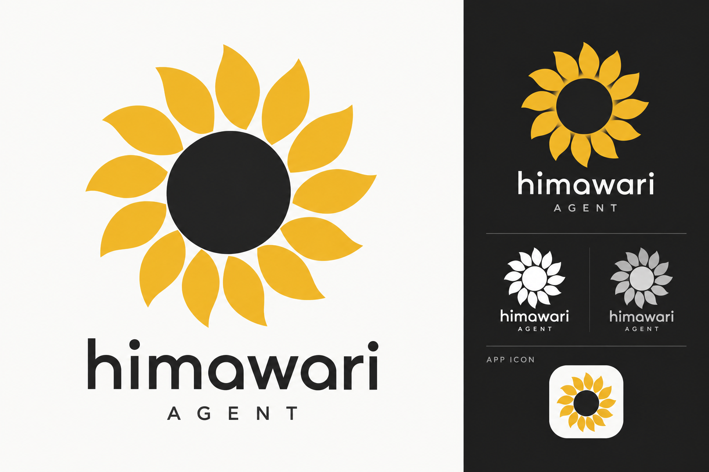

# Himawari Agent Logo

`v1/` 保存用户于 2026-09-10 确认的 Logo 原始 PNG。设计来自用户提供的向日葵照片：以金黄色花瓣、深色花心和简洁的放射轮廓表达 Himawari（日语“向日葵”的罗马音）。

| 文件 | 用途 | 格式与边界 |
| --- | --- | --- |
| [logo-symbol-light.png](v1/logo-symbol-light.png) | 独立图标原图 | 1254 × 1254，RGB PNG，自带浅色背景，不是透明底 |
| [logo-identity-board.png](v1/logo-identity-board.png) | 品牌设计展示图 | 1536 × 1024，RGB PNG；包含字标、深浅背景、单色与应用图标的设计示意 |

以上文件逐字节保留已确认的生成结果。展示图中的不同应用方式仍是整张图片的一部分，尚未拆成独立透明图标或 SVG。不要将棋盘格背景的失败生成稿、旧稿或重新生成的近似图形加入此版本。

完整外观、交互和版本维护说明见 [Web 与 Logo 设计基准](../../../docs/execution/specs/2026-09-10-control-center-visual-baseline-design.md)。品牌金色与聊天界面可切换的主题色分别管理；`v1/` 留作原始参照，后续衍生资源另存并说明用途。
