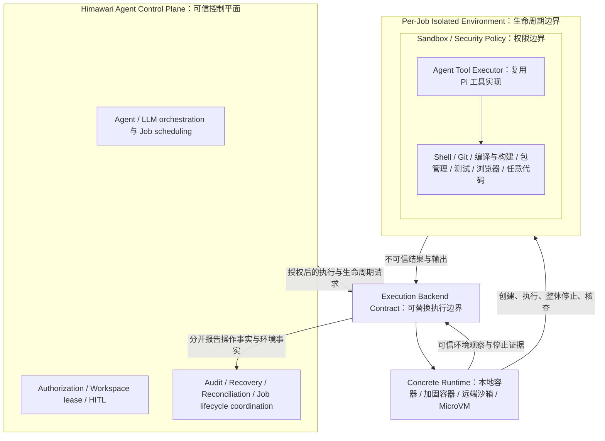
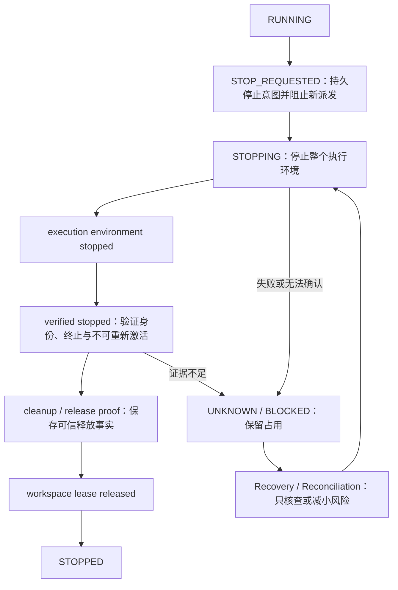

# ADR 0031：分离控制平面与任务级隔离工具执行环境

## 阅读导航

- [背景与决定](#decision)
- [正式架构图与职责](#architecture)
- [两个互补安全边界](#boundaries)
- [最小权限与失败关闭](#security)
- [工作区与停止证明](#release)
- [与既有 ADR 的关系](#amendments)
- [比较过的方案与后果](#consequences)
- [关联文档](#references)

## 背景与决定

> 2026-09-26 起，默认执行方式、容器的地位和 SRT 模式下的释放条件已由 [ADR 0033](0033-process-sandbox-default-and-optional-containers.md#amendments) 部分修正：macOS 和 Linux 默认使用 SRT 模式，容器改为明确打开的严格模式。本文以下内容保留原决定，修正范围以 ADR 0033 为准。

本决定记录用户于 2026-09-24 明确确定的长期架构：**Agent Control Plane 与具有副作用的 Effectful Execution Plane 分离；默认一个 Agent Job / Task / 执行 Session 对应一个独立隔离执行环境。** `accepted` 表示架构决定已经确定，不表示容器后端、迁移或平台资格已经实现。

ADR 0025 已将工具结果、任务和环境生命周期分开，但保留了宿主 SRT 首选及 macOS 尽力停止的路线。进程主入口退出、管道关闭、SRT reset、PID tree 或 process group 清理都不足以证明脱离原进程组的程序不能继续写文件。产品需要可以可靠停止整个任务环境的边界，才能安全地把 workspace 交给后续任务。

Shell、任意代码、编译器、构建工具、包管理器及其安装脚本、测试程序、Git 写操作、浏览器自动化、第三方 CLI，以及其他可能修改文件、访问网络、启动进程或产生外部副作用的 Agent 工具，默认必须在独立隔离执行环境执行，不得直接在 Agent 主进程或 Host Control Plane 执行。工具标注为 read-only 也不能证明其实现无额外 I/O；搜索器、临时文件及插件代码均受该边界约束。

同一任务中的多次工具调用共享任务环境，保存 workspace、Git 状态、依赖、构建产物及后台任务状态；**不采用每个 tool call 创建一个 container 的默认模型**。共享只在同一所有者、任务、冻结授权上界和期限内成立，不得合并不同 Grant 扩大权限。Job / Task / 执行 Session 在这里指一个有明确起止、授权和资源责任的执行单元，不等同于永久保活的聊天会话，也不改变现有数据库同名字段的历史含义；具体身份映射归 Spec。

## 正式架构图与职责

Control Plane 决定是否允许执行，负责 LLM 交互、调度、授权、workspace ownership / lease、HITL、审计及生命周期协调。Execution Plane 真正执行任务工具。图中的 Executor 是工具执行器，不引入第二套 Agent Loop；Pi 模型循环和工具定义继续复用。

Execution Backend 是产品拥有的合同，上层不依赖 OrbStack、Docker CLI 或供应商状态码。具体适配器翻译环境创建、执行、观察、整体停止与证明语义。第一阶段选择 Docker-compatible container；用户已验证的 macOS OrbStack 可作为本地 runtime 实现，但其既有验证不是本决定全部安全要求的资格证明，也不成为永久产品依赖。后端可以演进至 hardened container、remote container / managed sandbox 或 MicroVM；替换时重新验证后端能力，不重写上层授权、lease 和任务生命周期。

可信 Host 适配器可以进行受限的 runtime 管理、凭据代理和明确验证的产物发布。这些是控制或中介操作，不能接收模型任意程序、加载 workspace 插件、执行 Git hook 或变成绕过 Execution Plane 的通用 Shell。runtime socket、Host 私有控制 IPC、数据库和长期秘密不交给任务。窄接口的外部动作仍服从原授权、披露和审计合同，不因运行位置而获豁免。

## 两个互补安全边界

| 边界 | 回答的问题 | 必须承担的责任 |
| --- | --- | --- |
| Container / isolated execution environment：生命周期边界 | Job 是否仍活着？停止后是否还有属于它的执行资源可继续产生副作用？ | child、grandchild、daemon、detached process、background worker、`setsid`、double fork 和脱离原 process group 的后代仍归同一环境；能够整体停止并核查；禁止任务向边界外创建未管理执行资源 |
| Sandbox / security policy：权限边界 | Job 活着时允许做什么？ | 限制文件、网络、秘密、进程权限、IPC、syscalls 及 CPU、内存、进程数、时间和磁盘等资源 |

**Container 与 Sandbox 是互补层次，不是同一概念。** 两者可由同一 runtime 的不同机制实现，也可组合实现；拥有 container 标签本身不证明安全策略有效，单有权限沙箱也不证明任务整体生命周期可终止。

SRT 继续是 capability isolation 的可选机制，不能单独承担严格 Job lifecycle containment。macOS native SRT / Seatbelt 可继续用于适合且经资格验证的策略场景，但不得作为上述工具在 Host 执行的回退，也不能凭尽力停止签发新的严格环境释放证明。在 Linux container 内，若 SRT / Bubblewrap 形成不合理的嵌套 namespace 或兼容性问题，可以使用 runtime 与 Linux 安全机制实现同等策略；不得通过 privileged、开放宿主 namespace 或放宽访问范围来凑出可运行组合。

Browser 同样进入 Execution Plane：它的网络、下载、文件、cookie、凭据和 profile 都是任务能力。默认使用任务私有 profile；未来 remote browser backend 必须管理可验证停止的 browser session 与其关联资源，并提供相同授权、策略和恢复语义。断开控制连接不等于浏览器已经停止。

[↑ 返回阅读导航](#contents)

## 最小权限与失败关闭

所有 Job 采用 least privilege（仅授予任务必需能力）与 fail closed（缺少许可、能力或证明时拒绝执行或保持阻塞）。

| 范围 | 架构要求 |
| --- | --- |
| Filesystem | 仅显式授权的 workspace、必要输入和可信运行文件可见；可写路径单独授予。默认不暴露无关目录、其他 repository、Host Home、SSH key、credentials、runtime socket 和控制数据。授权目录中的敏感文件仍需保护；挂载目录不等于允许读其中所有内容 |
| Network | 默认拒绝，按授权使用 allowlist、egress proxy 或等价机制；必须实际阻断绕过代理的直连、私网/元数据服务及未授权出口，而非只设置代理环境变量 |
| Secrets | 不无条件暴露长期 credentials；优先 scoped、short-lived、brokered 或 proxy-mediated 凭据，绑定目标、任务、用途和期限；撤销与停止联动 |
| Privileges | 默认 non-root、非 privileged，最小 capabilities、no-new-privileges，使用适当 namespace、syscall 与 IPC 限制；任务不得取得 runtime 管理权或 Host root |
| Resources | 明确 CPU、memory、process count、timeout 和 disk / workspace 额度；所需限制不可强制时拒绝相应执行模式，不能把进程采样等同硬资源边界。原目录模式下挂载的用户工作目录改用非硬性磁盘保护，见 [ADR 0032](0032-original-directory-disk-and-sensitive-file-limits.md#decision) |

backend 不存在、未启动、health check 失败、environment 创建失败或 stop / inspect 无法确认时，返回明确、可恢复、可审计的错误；**禁止静默 fallback 到 Host execution**。恢复 backend 可用性不构成重放工具或重新消费批准的许可。

## 工作区与停止证明

核心 invariant：**旧 Job 的 execution environment 尚未被可靠确认无法继续产生副作用之前，不得释放其 workspace 占用，也不得让冲突的新 Job 接管。** TTL 到期、授权撤销、工具退出、Run terminal、ACK 到达和主 PID 消失都不是释放证据。

停止包含撤销新的工具派发、关闭任务出口、凭据及任务关联的浏览器/服务等持续能力。后端必须排除自动重启、旧消息重新启动和延迟请求复活。paused、停止请求被接收、主进程退出或一次空列表均不足以证明上述条件。停止后仍可能执行的外部任务必须纳入同一所有权与停止合同；无法纳管的远端异步执行不能声称满足本决定。

环境停止证明只证明不会继续执行，不撤销已经写入的文件、已经发送的数据或已经被远端接受的动作。操作结果与外部效果仍按原合同独立核查；有关 workspace 完整性的未知风险保留相应 barrier，不能伪造成功或自动回滚用户修改。与 workspace 无关的结果 ACK 延迟不能重新锁住已合法释放的资源。

释放事实按 ADR 0030 在可信验证接纳时持久化，并与 lease 释放原子关联；旧证据不会因时间推进重新失效。无法确认则保留 unknown / blocked 及冲突保护，进入有界 recovery / reconciliation；不重复 kill 猜测、不自动重放、不因人工点击“继续”抹掉风险。

## 与既有 ADR 的关系

本 ADR **部分修正（amend）0025 和 0026，不整份 supersede**。仓库现有 `supersedes` / `superseded_by` 表示整份替代，因此这里保留其原值，采用双向 `amends` / `amended_by` 元数据及正文范围链接；旧正文保留历史，不将两份决定同时解释为同一路径的现行许可。仅下表所列冲突范围以 0031 为准，其余继续有效。

| 原决定 | 继续有效 | 由本决定修正的范围 |
| --- | --- | --- |
| [ADR 0025](0025-pi-tools-and-managed-execution-lifecycles.md) 决定 1–4、7–8 | Pi 复用、完整工具 I/O 边界、Capability/Grant/Handle、独立结果/效果/监管/清理、禁止未知重放、高风险与披露检查 | 不因原首批能力列表自动启用浏览器、MCP 或 Git push；它们一旦接入仍须执行本边界 |
| ADR 0025 决定 5 | 独立所有权、冻结权限、禁止全局可变 manager 和跨 Grant 权限合并 | 取消“直接操作宿主目录的 SRT 为首选后端”；默认任务级隔离环境，多工具共享一个环境；独立 Job Host 进程不再等同完整生命周期边界 |
| ADR 0025 决定 6 及相应方案比较、影响 | 按平台/mode 验证、未知不冒充已确认、资格失败不回退 | macOS 新执行路径必须具备任务级环境停止证明，尽力停止只保留为 legacy 事实；容器不再只是可选增强；本地隔离 runtime 可成为这类工具的必要前置条件 |
| [ADR 0026](0026-job-scoped-network-egress.md) | 每任务可信出口、目标/地址校验、防重新解析绕过、停止关闭连接、迟到 DNS 不重开、无凭据泄漏 | “每个 Job Host 必须使用 SRT 客户端代理及 parentProxy”限定为 legacy SRT 实现；新后端可用等价可验证出口，不要求 SRT binary 永久存在；Mac 文件撤权限制不再是新后端资格豁免 |
| [ADR 0030](0030-durable-workspace-release-facts.md) | 持久释放事实、ACK 与释放分离、后续风险新建 barrier、授权范围与实际占用分离 | 不替代；新环境级证明成为该事实的输入，单次调用结束不释放仍存活任务的环境 lease |

0021、0022、0024 的历史替代链仍指向 0025，不恢复旧路线。ADR 0023 的通用审批/恢复继续有效。现有实现迁移期间仍按其真实保证报告，不能把本决定当作原 Mac 环境已经具备严格 containment 的证据；新目标的代码、兼容和迁移顺序归后续 Spec / Plan。

[↑ 返回阅读导航](#contents)

## 比较过的方案与后果

| 方案 | 判断 |
| --- | --- |
| 继续以 Host SRT + PID tree / process group 停止作为严格边界 | 拒绝；不能覆盖 daemon、setsid、double fork 等脱离场景，无法可靠释放 workspace |
| 每次 tool call 新建 container | 不作为默认；丢失任务级依赖、产物和后台状态，增加反复创建成本；不能解决跨调用所有权问题 |
| 所有任务共用一个长期容器 | 拒绝；权限和状态跨任务污染，无法独立停止并证明某任务释放 |
| Container 取代所有 security policy | 拒绝；网络、挂载、凭据、权限和额度仍需显式约束 |
| 强制永久采用 OrbStack 或容器内嵌套 SRT | 拒绝；把供应商/实现细节固化为产品合同，妨碍兼容与增强隔离 |
| 可替换 backend + per-job 环境 + 等价 capability policy | 采用；把可终止性、可访问范围和授权权威分别落实，并允许未来替换 runtime |

代价包括 runtime 可用性依赖、镜像与平台资格维护、任务状态存储、挂载语义和停止证明协议，以及长期环境的资源占用。Linux 容器中的构建产物和工具链不自动等价于 macOS native；Host 专有工具缺少合格后端时应明确不可用，不能偷偷在 Host 执行。共享内核容器也不是所有威胁的绝对防护，高风险场景可以要求更强后端。

收益是可独立审计的任务所有权、严格停止与 lease 释放条件，以及不依赖具体供应商的演进路径。是否已满足这些保证，以实际后端资格和恢复验收为准。

## 关联文档

- 当前事实：[SOURCE: docs/architecture-v0.1.md]
- 被部分修正的决定：[SOURCE: docs/adr/0025-pi-tools-and-managed-execution-lifecycles.md]、[SOURCE: docs/adr/0026-job-scoped-network-egress.md]
- 持久释放：[SOURCE: docs/adr/0030-durable-workspace-release-facts.md]
- 工作区合同：[SOURCE: docs/execution/specs/2026-09-16-workspace-authorization-lifecycle-design.md]
- [详细 Spec](../execution/specs/2026-09-24-isolated-tool-execution-design.md)：[SOURCE: docs/execution/specs/2026-09-24-isolated-tool-execution-design.md]
- [迁移 Plan](../execution/plans/2026-09-24-isolated-tool-execution-plan.md)：[SOURCE: docs/execution/plans/2026-09-24-isolated-tool-execution-plan.md]
