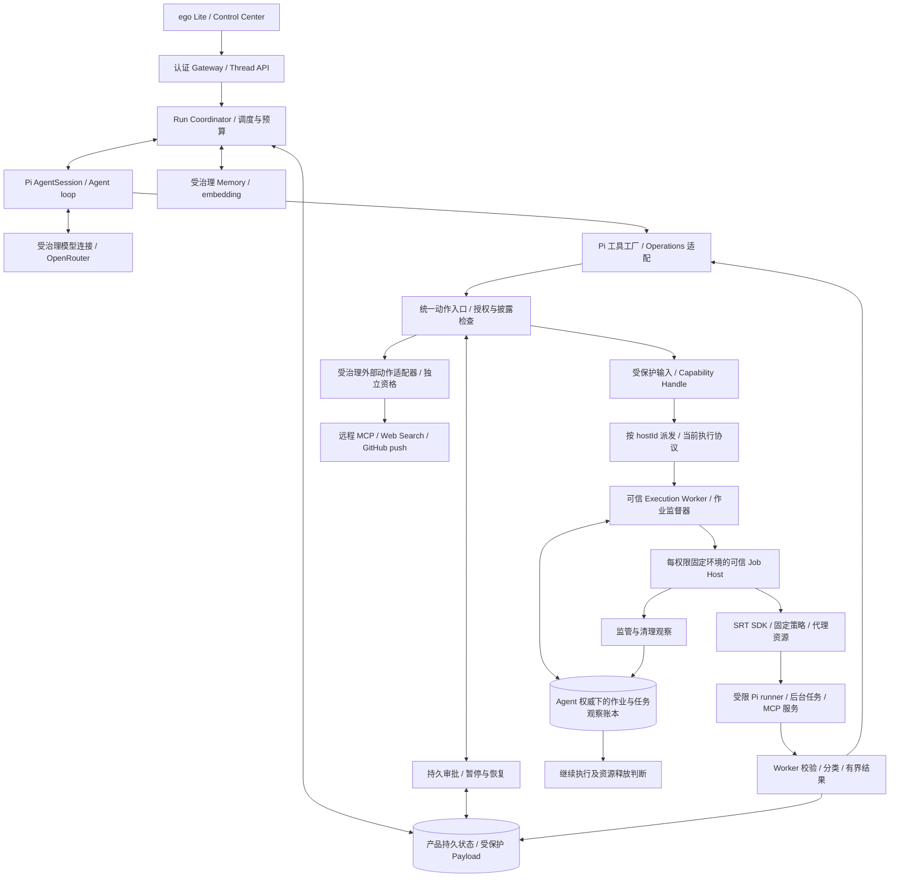
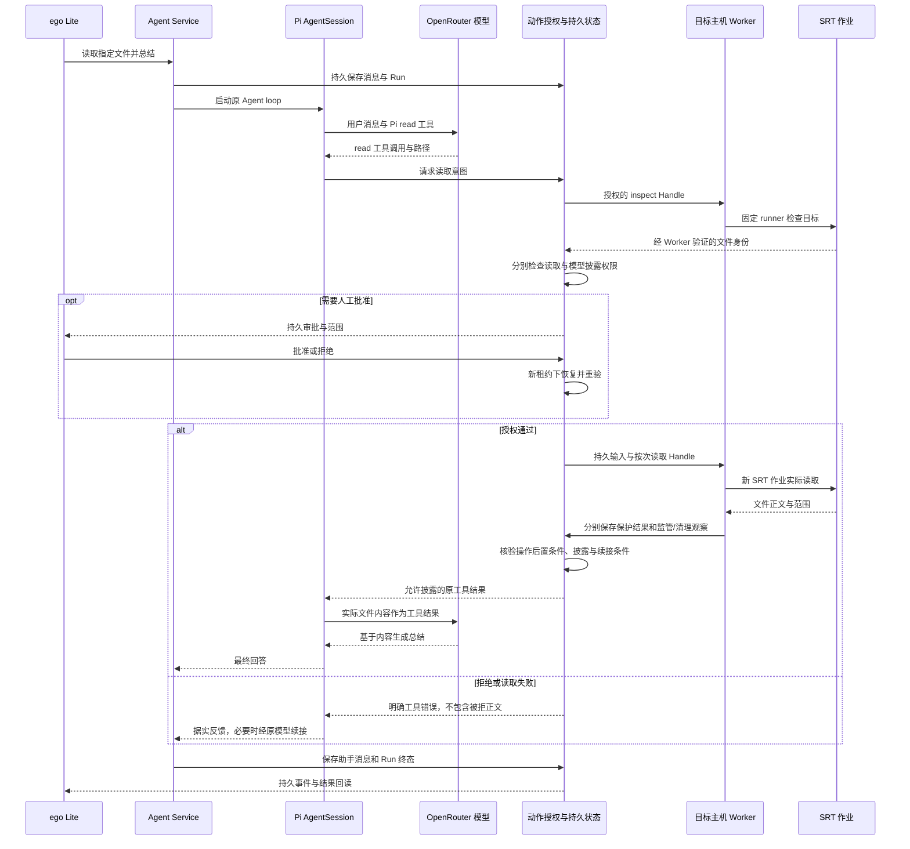
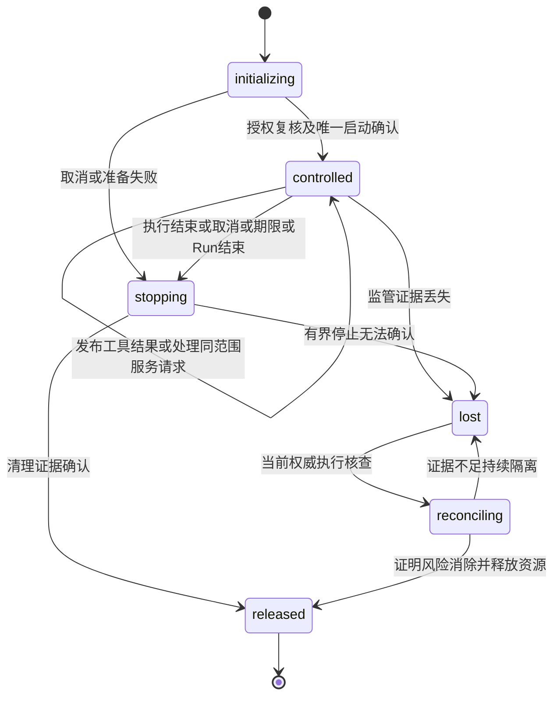

# Pi 工具复用与 SRT 受管理执行设计

## 目标

让 Himawari 的 Agent 通过统一的产品执行入口使用文件、Shell、程序和本地 MCP，不在 Agent loop 或工具业务代码中分辨 macOS 与 Linux。由 Anthropic Sandbox Runtime（下称 SRT）实现受限进程启动，Himawari 管理授权、执行生命周期、持久恢复和输出披露，Pi 继续管理模型交互及工具循环。

本文在保留 2026-09-07 已确认产品范围的前提下，于 2026-09-09 按 Owner 已批准方案重新设计工具、任务及环境生命周期；它是目标设计，完整执行链路尚未实现，也未取得真实主机资格。Owner 已否决先建设签名 Mac 文件访问 helper 的路线，要求改用 SRT；本文不把原生 helper、security-scoped bookmark 或 Apple container 安装列为新路线的前置条件。首批必须包含文件和编码工具、受限 Shell、MCP、授权联网、Web Search 及 GitHub 已有 commit 推送，默认直接操作已授权原项目。工程细节由实施与验证落实；已有代码与历史验收状态不因本文而变成 SRT 实现。

2026-09-09 已批准的接入细节：复用现有调用回执、文件工作流 context、作业账本及认证 Payload 通道。网络授权引用须指向本次操作的同一 Grant；审批快照 `targets` 的 `network-domain` 目标保存确切域名，Agent 检查当前 Grant、审批指纹和主机上界后把核验 scope 交给 Worker，启动前再次核对。此映射不再次消费授权。Worker 独占策略编译；`prepared` 可不带策略摘要，首笔原子 `starting` 固定摘要，此后的观察不可改变它。资源采样作为现有作业观察的可选字段持久保存，不修改原 stdout Payload 合同，也不增加 Run 状态机。

## 来源上下文

- 用户提供的完整集成指南：[Anthropic SRT AI Agent Integration Guide](../../assets/others/Anthropic_SRT_AI_Agent_Integration_Guide_2026-09-07.md)。原文作为输入保留；其中测试清单是要求，不是已通过证据。
- 当前架构：[SOURCE: docs/architecture-v0.1.md]
- Pi 与产品状态边界：[SOURCE: docs/adr/0001-pi-runtime-adapter.md]、[SOURCE: docs/adr/0015-product-state-over-pi-runtime-projection.md]
- 历史平台隔离路线：[SOURCE: docs/adr/0022-mac-tiered-command-sandbox.md]
- 保留的通用审批与恢复决定：[SOURCE: docs/adr/0023-durable-hitl-execution.md]
- 本设计的已采纳决定：[SOURCE: docs/adr/0025-pi-tools-and-managed-execution-lifecycles.md]；前序决定 [SOURCE: docs/adr/0024-srt-unified-execution.md] 保留历史正文。
- 原始真实文件总结验收：[SOURCE: docs/execution/specs/2026-09-07-real-file-summary-agent-loop-design.md]

### 已核对的上游边界

审查基线为 `@anthropic-ai/sandbox-runtime@0.0.75`，发布标签提交 `40804af`。官方仍标记 Beta Research Preview。设计审查阶段核对了固定标签的 README、包元数据、manager、配置、schema 和 Mac/Linux 后端源码。2026-09-08 的实施已固定安装该版本、加入候选策略编译，并通过 Mac 固定假数据的文件/网络拒绝探针；可安装 Job Host 组件已实现并通过固定假数据探针；2026-09-09 已加入正式 Worker 组合、资源观测与受控组合探针，正式主机及恢复资格仍未完成，证据范围见配套 Plan。[发布记录](https://github.com/anthropics/sandbox-runtime/releases/tag/v0.0.75)、[README](https://github.com/anthropics/sandbox-runtime/blob/v0.0.75/README.md)

`SandboxManager` 有模块级配置与代理状态；`wrapWithSandboxArgv()` 产出启动描述，在 Mac/Linux 上仍包含 shell 语义，返回的 `env` 来自调用进程。其 `cwd` 参数目前不影响这两个平台的规则生成。`cleanupAfterCommand()` 清理辅助挂载文件；`reset()` 回收 SRT 自身资源，不能替代 Himawari 对整个任务进程树的终止证明。[manager 源码](https://github.com/anthropics/sandbox-runtime/blob/v0.0.75/src/sandbox/sandbox-manager.ts)

SRT 使用 macOS Seatbelt 与 Linux bubblewrap 等机制，不是 VM。`allowRead` 是被禁止范围中的读取例外，不是全盘默认拒绝的白名单。应用必须编译自己的保护目录与例外，并验证具体规则的优先级，不能照字段名称推断隔离保证。[配置源码](https://github.com/anthropics/sandbox-runtime/blob/v0.0.75/src/sandbox/sandbox-config.ts)、[Mac 后端](https://github.com/anthropics/sandbox-runtime/blob/v0.0.75/src/sandbox/macos-sandbox-utils.ts)、[Linux 后端](https://github.com/anthropics/sandbox-runtime/blob/v0.0.75/src/sandbox/linux-sandbox-utils.ts)

历史公告 GHSA-9gqj-5w7c-vx47 影响 `<0.0.16`，修复于 `0.0.16`；它说明空网络允许列表需要永久回归，不能据此声称 `0.0.75` 仍受该漏洞影响，也不能据此认定当前版本无其他问题。[安全公告](https://github.com/anthropics/sandbox-runtime/security/advisories/GHSA-9gqj-5w7c-vx47)

### 调研依据与可复用边界

调研日期为 2026-09-09。下列资料提供职责和生命周期设计证据，不构成本项目运行资格。主流实现中的宽松默认值不自动成为 Himawari 权限策略；具体源码与项目固定版本不一致时，以当前固定依赖及实际测试为准。

| 证据 | 观察 | 本设计采用及限制 |
|---|---|---|
| [Codex 沙箱文档](https://learn.chatgpt.com/docs/sandboxing)与[执行进程管理](https://github.com/openai/codex/blob/main/codex-rs/core/src/unified_exec/process_manager.rs) | 审批与 OS 沙箱是不同控制；执行响应区分存活 process ID 和退出结果 | 分开授权、工具结果与资源生命周期；不从此推导本项目已具备同等终止能力 |
| [Claude Code 后台命令](https://code.claude.com/docs/en/interactive-mode#background-bash-commands) | 后台运行先返回任务 ID，另行读输出和停止，并有退出清理责任 | 显式任务句柄与资源所有权；不把后台化理解为忽略清理 |
| [Gemini Shell 工具](https://geminicli.com/docs/tools/shell/) | 支持后台参数，输出包含退出码及后台 PID | 后台启动结果与工作完成分开；本项目不用可复用 PID 作为授权凭证 |
| [OpenHands 工具架构](https://docs.openhands.dev/sdk/arch/tool-system)与[Workspace](https://docs.openhands.dev/sdk/arch/workspace) | Action/Observation 与有状态 executor 清理、环境管理分开 | 工具语义保持稳定，环境由独立生命周期管理 |
| [E2B 后台命令](https://docs.e2b.dev/commands/background) | 沙箱及命令有各自 ID，可重连等待或终止 | 句柄持久关联是必要机制；不把 SDK 重连等同产品授权恢复 |
| [MCP 取消](https://modelcontextprotocol.io/specification/2025-11-25/basic/utilities/cancellation)与[生命周期](https://modelcontextprotocol.io/specification/2025-11-25/basic/lifecycle) | 取消可能被忽略或与完成竞态；请求与连接关闭不同 | 取消不能证明未生效；复用现有 SDK，不重写协议 |
| [Anthropic 隔离设计](https://www.anthropic.com/engineering/how-we-contain-claude)与[安全部署](https://code.claude.com/docs/en/agent-sdk/secure-deployment) | 不同产品使用不同隔离边界；受控工具可把凭据保留在代码执行环境之外 | SRT 本地为主，强隔离后端另行资格；远端业务权限由受控适配执行 |

Pi 核对使用指定只读 checkout `/Users/triggerjames/Documents/sxl_code_work_space/pi-mono`，提交 `a69bef789bc95abf0acee16f7b4660b70b650bb9`，版本 `0.84.2`，并核对本项目安装包的 Bash/Grep 类型。不是远程最新版本声明。可复核[固定 Pi 源码](https://github.com/earendil-works/pi/tree/a69bef789bc95abf0acee16f7b4660b70b650bb9/packages/coding-agent)。

| Pi 文件（相对 coding-agent 包） | 可直接复用的能力 | 接入约束 |
|---|---|---|
| `src/core/tools/{read,write,edit,bash,find,grep,ls}.ts`、`src/index.ts` | 七种工厂、参数/结果和 Operations；Bash 的 signal/timeout/onData | 已有 `runtime-pi` 工厂与端口继续复用；不在 Agent Service 执行其默认 I/O |
| `src/core/tools/grep.ts` | Pi 参数及搜索结果语义 | `GrepOperations` 不接管 `spawn(rgPath)`；须在受限 runner 内运行搜索器，不声称补两项 Operations 即完成远端路由 |
| `src/core/tools/path-utils.ts`、`output-accumulator.ts` | 路径处理、长输出截断 | 存在 Operations 外的文件探测和临时落盘；整段工具实现、私有 tmp 与产物导出均需受限 |
| `examples/extensions/sandbox/index.ts` | `BashOperations` 接 SRT 的模式 | 示例仅包 Bash、允许关闭且初始化失败可回退本地；示例 SRT 0.0.26 不能覆盖项目 0.0.75 合同 |
| `examples/extensions/ssh.ts` | 远端文件和命令 Operations 路由 | SSH 不是隔离或远端任务死亡证明；路径与命令编码须产品验证，不能照搬示例字符串拼接 |
| `examples/extensions/gondolin/index.ts` | 工具到 `vm.fs/vm.exec` 的适配及会话关闭；示例使用 Gondolin 0.12.0 | 默认宿主目录挂载写回，不能视为回滚副本；未在本项目运行或取得资格 |
| `README.md` 的功能边界 | Pi 扩展机制可加入额外工具 | 当前不内置 MCP 或后台 Bash 管理；后者不能塞进只返回 exitCode 的前台接口 |

## 范围

包含整个产品的执行职责划分、Pi 接入、Worker 与 SRT 生命周期、文件/工作区、通用 HITL、Shell/MCP/外部 API、输出、资格、迁移及验收设计。首批包含文件读取、原项目内编辑/写入/搜索、受限 Shell、本地 stdio MCP 及受治理远程 MCP 接入、授权联网/依赖安装/下载、真实 Web Search 与 GitHub 已有 commit 推送。每类实际启用的适配器必须通过对应资格；受管理后台任务和持续服务是本次通用 Shell/MCP 生命周期设计的必需验收部分，不新增跨 Run 常驻服务或产品调度 Task。第一批必需能力缺失时报告交付未完成，不能将其静默移为后续任务。认证浏览器自动化未因公共搜索需求而自动成为本批要求。

不重写 Pi AgentSession、Provider 协议或工具参数体系；不把 SRT 当作模型 SDK、远程 Worker 通信协议、权限数据库或系统安装器。本文不实施代码、不执行付费模型请求、不更改主机安全设置，也不声明已经能从浏览器完成真实文件总结。

## 验收标准

验收编号供 Plan 唯一映射；均为目标，未因设计批准勾选通过。

| 编号 | 场景与可观察结果 |
|---|---|
| EX-01 | Pi 七种工具复用，Agent 侧无真实文件/进程 I/O；runner 内的路径探测、rg/fd、图片处理及长输出不能越过授权边界 |
| EX-02 | 多个并发/父子调用从已有回执取得身份；同一授权不二次消费，子范围不扩大；缺失可信来源拒绝，不新造身份库 |
| EX-03 | 准入、准备结束、启动/服务派发时重核目录、同 Grant 网络 targets、fence、期限和运行产物；撤权、篡改、主机替换均不产生新执行 |
| EX-04 | 一次性文件 inspect/read 保留双阶段授权；真实正文回到原 Pi 调用并按当前模型披露；空结果有明确证据而非缺失输出 |
| EX-05 | edit/write/search 与原目录工作树行为保持；冲突不覆盖，删除沿通用 HITL；Pi 截断不取消产品输入上限 |
| EX-06 | 前台 Shell 输出/退出/超时可区分，exit 0 不宣称 Git 或其他业务效果；工具结果与清理事件独立持久 |
| EX-07 | 后台 start 先持久任务身份，返回句柄；status/output/cancel 均绑定调用与范围；重放 start 不启动第二任务，ready 与已创建不同 |
| EX-08 | MCP 至少两次请求可使用同一受管理连接，每请求独立授权和结果；拒绝混入不同 Grant，关闭一条请求不误报 server 已退出 |
| EX-09 | 已持久结果、结果可披露、可继续、环境可复用和 Run 正常完成分别判断；cleanup unknown 保留，依赖不安全时不续接 |
| EX-10 | 取消、超时、超限与结果返回竞态保留实际事实；Run 取消后不续接模型，不将停止通知视为副作用撤销 |
| EX-11 | Worker/Job Host 真正崩溃、PID 复用、启动 ack 丢失和持有管道/setsid 后代可核查；未知不重放，隔离锁阻止相关工作区新任务 |
| EX-12 | 旧 v1 记录/审批/结果可回读；v1 unknown 不升级为成功；v1/v2 能力不匹配不启动；升级/回退不重新解释权限 |
| EX-13 | Mac 与需启用的 Linux 分别验证文件、网络、资源采样、停止及监管保证；不把采样当硬配额，不用合成资格签发生产 profile |
| EX-14 | 授权联网/依赖安装/下载、秘密拒绝、重定向与 SSRF、原始 socket 和代理失败拒绝按实际后端验证；撤权停止限制如实可见 |
| EX-15 | 真实 Web provider 返回可核实来源与时间、查询披露/预算；失败无编造，远端动作不宣称受本机 SRT 完整隔离 |
| EX-16 | 指定 GitHub 仓库/ref/已有 OID 经独立授权推送，工作树不被提交；拒绝强推/其他目标/源 hook；断连先 readback 不盲目重推 |
| EX-17 | ego Lite 真实模型/审批/Worker/Pi 续接、刷新及重启回读；不增加模型调用或重跑工具，UI 同时呈现结果与资源异常 |
| EX-18 | 安装版本、runner/profile/保证、迁移及停止合同与真实产物一致；所有模型可达启动点均有归属，旧路径无裸执行 fallback |

## 设计

### 1. 整体架构与信任边界



这张图是目标架构。Agent Service、长驻 Execution Worker 与每权限固定环境的 Sandbox Job Host 都是可信产品进程；只有最后的工具进程树处于 SRT 限制之内。Job Host 不加载工作区插件、不执行模型脚本、不携带模型或云端真实凭证。SRT 代理也在可信侧，必须受生命周期监督。

“统一运行时”指统一宿主执行合同。模型网络请求、产品数据库、身份校验和 Memory 仍属于可信控制路径，不能搬入会执行不可信代码的沙箱。外部 API 动作也从同一动作入口接受产品治理，但 HTTP adapter 的服务端副作用不能被宣称受到本地 SRT 隔离。

| 层 | 保留或新增的责任 | 不应承担的责任 |
|---|---|---|
| 浏览器与 Gateway | 身份、CSRF、消息、审批展示、持久事件与回读 | 生成沙箱配置、直接启动宿主命令 |
| Pi runtime | AgentSession、模型流、工具 schema、标准工具语义、工具批次 | 宿主授权、直接默认本地 I/O、恢复权威数据库 |
| 应用层执行入口 | 确定动作与目标、ALLOW/ASK/DENY、预算、Handle、结果披露 | 拼接 Seatbelt/bwrap 规则、OS 分支 |
| Execution Worker | 验证派发、一次性执行、作业监督、恢复核查、保护结果 | 把不可信 stdout 当作可信执行回执 |
| 每权限固定环境的 Job Host | 干净环境、固定 SRT 配置、受限进程启动与 SRT 资源生命周期 | 自行批准扩权、与其他作业共享可变 manager |
| SRT | 平台文件/网络隔离规则及受限启动机制 | HITL、持久 exactly-once、全面资源配额、远程主机路由 |
| 平台适配与资格 | 依赖、路径布局、进程监督、实际隔离保证 | 让业务代码感知具体 OS，失败时静默降低保证 |

Mac 本机文件仍由 Mac Worker 执行。Hermes 上的 Agent Service 不能因为 SRT 跨平台就直接读取 Mac 路径。主机身份、配对、传输认证和 authority fence 继续沿用现有产品机制。

以“读取指定文件并总结”为例，目标时序如下；inspect 与 read 分别是权限固定的作业，未决审批保存在产品状态中，不要求保留活着的沙箱进程。



### 2. Pi 复用方式

`runtime-pi` 是唯一 Pi 包导入边界。模型侧复用固定工厂的名称、描述、参数及提示，只将调用交给现有 `RuntimeToolPort`；不在 Agent Service 执行 Pi 工具算法。目标主机受限 runner 内调用 `createGovernedPiCodingTools()`、`createPiOperationsFromGovernedHostPort()` 与已有 HostFileReadService。整个工具实现及其子进程都处于同一授权环境，避免 Operations 外的探测、临时输出和搜索器成为旁路。

每次执行用 `operationsForCall` 或受信 runner 内不可变的固定 Operations 绑定本次调用；不使用可变全局 current-call。read/edit/write 的复合 I/O 共用同一 invocation 范围，不为每个底层 read/write 再消费 Grant。元数据 inspect 与正文 read 的既有双阶段审批仍保留，不能因复合工具概念而合并授权。

| 工具 | 复用与必要适配 |
|---|---|
| read | 复用文本/图片展示与 offset/limit；现有两阶段文件服务先检查主机、目标身份、类型、大小与披露；未接入图片的生产 profile 明确拒绝，不伪装支持 |
| edit/write | 复用 Pi 编辑和写入语义；产品端口负责版本冲突、受控替换及原目录授权；Pi 进程内 mutation queue 不能代替跨进程/用户并发检查 |
| bash | 原前台 schema、输出截断和秒单位 timeout；产品转换单位并过滤环境，命令执行在受限 runner。不能继承完整宿主 env |
| find/ls | 在受限 runner 注入对应 Operations；find 的 glob 可替换，缺省 fd 路径也必须绑定已安装工具及 scope |
| grep | 复用原搜索实现并在受限 runner 运行真实 rg；不在 Agent 侧靠 GrepOperations 实现远端搜索。若未来后端不能执行原工具，先评估上游可兼容注入点，不复制搜索协议 |
| 后台执行 | 通过 Pi ToolDefinition 扩展注册产品管理动作，复用 Worker 命令启动和输出机制；不改变前台 Bash 的 exitCode 合同，不另写 Agent loop |
| MCP/Web | 复用当前 MCP SDK 与 Web 端口，通过 Pi 注册薄适配；服务器元数据与 readOnly 等提示不是可信授权 |

工具目录和 runner 使用同一版本化描述，缺少 Operations/runner/profile 不启用。工作目录、私有 HOME/tmp/cache、PATH、搜索器/解释器路径均由可信安装/计划决定。Pi 的工具自动下载能力在正式执行中不作为隐式权限：依赖必须预装并验证；缺失则拒绝，或另走已批准安装动作。长输出只落入受管私有目录；面向模型返回受保护产物引用，不能直接暴露或信任任意 fullOutputPath。环境结束前由 Worker 在原授权范围内导出结果；无法导出不得伪造完整输出。

### 3. 执行合同与持久权威

#### 3.1 身份、范围与数据所有权

统一治理继续沿 RuntimeToolPort、Capability 接纳和 Worker 派发。SQLite invocation receipt 是凭证消费权威；Run checkpoint、工具结果及保护 Payload 保留原职责。现有作业账本追加资源关联和观察，不创建第二个权限库、Run 状态机或产品调度 Task。

宿主执行关系固定为：`Run → toolCall → invocation → attempt/job → environment`。狭窄远端 API 仍使用原 invocation/result，不为一次 HTTP 请求虚构本地沙箱；远程 MCP 的 connection 记录绑定创建调用及远端身份，不能伪造本地 PID 或 SRT 清理证明。一次前台操作默认有独占 environment；后台 task/service 由其创建 invocation 关联 environment。同一服务可被多个后续 invocation 引用，但只允许同 Owner/Agent/Run/host、同创建 Grant 及同冻结 scope；每个请求都有自己的输入、Handle 和结果。资源句柄只是定位符，不是授权凭证。没有创建结果的操作不能凭裸 PID、URL 或模型提供的 session ID 取得控制权。

目录、网络、父调用、模型和期限来自既有持久来源。`networkAuthorizationRef` 指向本操作同一 Grant，核对审批 snapshot targets 中的确切域名、审批指纹及主机上界；不二次消费该 Grant。子调用只能缩小父范围，不能把父引用当作所有后续操作的通行证。生命周期延长不在本批自动支持；有效期取原 Run/授权/调用期限及资源额度的最小值。

#### 3.2 版本化目标数据

目标为产品内部 `sandbox-execution.v2`，不是重命名现有外层 `execution.v2`。下列字段是待实现合同；现有 v1 保留原解释和读回能力。所有身份、绑定、时间、引用和枚举采用严格 schema；未知字段、不同分支字段混用、非有限数及不匹配摘要都拒绝。

| 记录 | 必需内容及验证责任 |
|---|---|
| ExecutionPlan | 沿用 invocation/Handle/input/model/lease 身份；冻结 `mode`（foreground、background、service）、operationContractRef/version、scope 摘要、host/backend/profile/runtime/runner/qualification 身份、requiredGuarantees、原期限和资源上限；候选不伪造消费指纹 |
| 环境关联 | 本地 sandbox 与远程连接使用互斥 kind；本地记录 environmentId、创建 invocation/job、mode、唯一监督器 boot 身份/epoch、不可变 scope/policy 摘要、期限、工作区冲突范围及私有目录所有权；实际 PID 只作为带启动标记的观察 |
| OperationResult | 绑定 invocation/attempt 和 contract；结果种类 result/started/error/unknown；安全结果 Payload 引用和摘要；命令 exit/signal、服务 readiness 或任务句柄按分支保存，不能互相冒充 |
| EffectObservation | not_applicable、not_asserted、verified、unknown 四种语义；verified 必须有 verifier/version、目标、证据引用/摘要与核查时间；unknown 带待核查原因，不由子进程自报确认 |
| ResourceObservation | task/service/environment 身份、sequence、occurredAt、supervisor 身份；监管 initializing/controlled/stopping/lost/reconciling/released；清理 pending/confirmed/unknown；观测指标、停止原因和证据引用；原 outcome/output 不被资源更新覆盖 |
| 任务/服务句柄 | 随机不透明引用；持久绑定创建调用、Run、host、scope、期限、后端关联；任务状态 starting/running/exited/unknown，服务另有 starting/ready/unavailable 的 readiness 事实；句柄内容不提供权限 |

`not_applicable` 仅用于工具合同能证明没有本次要确认的用户/远端变更，例如固定只读 runner；私有日志清理由资源义务另行管理。`not_asserted` 表示正常返回的通用命令只承诺退出/输出，不承诺业务效果：它依然需要覆盖可能写入/联网的授权。中断、输出丢失、必需后置条件缺失不能降为 not_asserted。文件写入和专用 Git push 必须核查对应内容或远端效果，禁止选择更弱合同绕过失败。verified 不能从任意 stdout 的 success 字段推导。

#### 3.3 端口与命令分派

继续扩展现有 `SandboxExecutionPort`，保留 prepare/start/observe/cancel/reconcile 的所有权；主机适配只提供可核实事实，不决定业务授权。目标版本增加受管理资源的 `inspectResource`、`readResourceOutput(cursor, limit)`、`stopResource` 和 `invokeService` 语义，通过既有认证 Payload broker 分派。具体导出符号在实施时遵守现有命名；行为及权威边界以本文为准。

start 只有在原子消费并建账之后、唯一 starting CAS 获胜且当前 scope/资格复核通过时触发。后台 start 在启动前持久资源标识；ack 丢失只核查已存在的身份，不新建任务。每条后续服务执行请求都由现有准入消费自己的 Handle 一次，同一 Grant 的允许次数照常生效；范围验证和资源查询不重复消费已消费的执行凭证。

输出读取经过所有者/范围/披露检查，以有界、可重读 cursor 返回保护引用及截断元数据。禁止把同一流多次读取误算成新执行。停止和核查可在原执行授权过期后由当前可信权威执行，仅能减小风险、保存观察；不能借控制通道再运行用户命令或扩大文件读取。清理命令限定到原受管资源，禁止宽泛 pkill 或按可被替换的路径递归删除。

#### 3.4 工具结果、续接和资源释放的判断

判断由一个产品投影规则实现，引用同一持久结果/观察，不分别在 Worker、UI 和 Pi 中猜测成功。

| 情况 | 工具结果与用户展示 | Pi 续接/新动作 | 环境与 Run |
|---|---|---|---|
| 固定一次性工具完成，必要后置条件成立，结果已保护；监管有效、清理尚在期限内 | 可发布本次操作结果，注明资源尚未释放 | 当前权限/披露通过且无相交风险时可续接；共享原目录仍遵守占用锁 | 本独占环境不接新任务，直到清理确认；Run 不提前宣称所有资源已结束 |
| 前台命令正常退出且完整结果落库，没有专用业务效果合同 | 仅报告退出码及输出，effect=not_asserted | 仍检查监管、冲突范围及权限；后续需要业务效果时须独立核查 | 退出码不能被解释为全部后代回收 |
| 后台任务已登记启动，服务已通过声明的 readiness | 返回 started/句柄或服务 ready，不能报告后台工作已完成 | 在批准范围内可查询或调用；未 ready 的服务不收请求 | 保留创建 Run 资源义务和额度，不能释放占用假装进程退出 |
| 操作失败或必要后置条件未成立 | 返回可解释失败；已发生的效果单独保存 | 只有相关风险已可控才能继续；不自动重做未知副作用 | 停止与清理继续进行，失败不免除资源义务 |
| 结果已知但监管丢失或清理未知 | 可向获授权用户展示“已有结果，资源待核查”；不抹去已确认效果 | 进入原 Run 核查/暂停路径，不再发起依赖该资源的动作或模型续接；独立 Run 仍需避开隔离范围 | 持久隔离相关环境和工作区范围，不正常完成、不复用 |
| 启动 ack/结果未知，或取消、超时、撤权竞态 | 分别展示停止请求与已知证据，不说未执行或已撤销 | 不自动重试、不把迟到结果触发为下一轮；取消 Run 禁止续接 | 有界停止与核查；无法确认则隔离 |
| 全部必需结果确定，资源清理确认且无未决审批/核查 | 由原 RunCoordinator 按用户目标报告整体结论 | 不新增隐含动作 | 才可正常终结 Run；目标失败仍报告失败而非伪造成功 |

`controlled` 必须由该 profile 的资格规则和带时效的监督证据产生，至少绑定正确 boot/进程启动身份、范围与未过期监督窗口；没有心跳或只有父 PID 存活不能证明任意后代受控。能力声明中的“无法保证任意后代回收”和本次“已失去监管”是不同事实，但不能用前者给后者重新贴 controlled 标签。存在具体逃逸/残留风险、不可核验所有权、观测失效或应急停止失败即进入 lost/unknown。监管有效期间也不能跨已冻结权限续命。

继续模型与新动作准入必须读取最新资源 sequence、有效监督窗口及当前 Run/fence；同事务提交继续意图时检查它们未改变，实际派发前再次核验。故障在派发后才被观察到时，停止已在途工作并保存其不确定性，不能宣称能撤回已经外发的请求。

操作 terminal result 只提交一次到原 toolCall，资源后续观察不反复向 Pi 注入相同终态结果。晚到的副作用核查作为审计/核查更新保存；没有发布的工具结果可在核查与当前权限通过后恢复原调用，已发布结果不得悄悄改写。Run 取消或过期保持原终态规则，核查可以继续但不能恢复用户执行。

### 4. 环境、后台任务与服务的生命周期

#### 4.1 共用监督机制

Agent Service、长驻 Worker 和 Job Host 仍在可信侧，实际 runner/脚本/MCP server 受限。每个权限固定的 environment 对应一个独立可信 Node Job Host 与一次初始化的 SRT manager。前台默认每作业独占；后台任务或服务可让该环境持续至原期限，但不能使用共享全局 manager 或原地 updateConfig。新权限对应新批准动作及新环境；有相交未知资源时不得启动替代环境。

准备、运行和清理各有有界窗口，均记录原期限；执行期限到达停止用户执行，应急清理窗口只允许减小风险。Worker 和 Job Host 双向失联都触发停止；资源观测超阈值或失效亦请求停止。独立监督轮询、任务查询和输出查询不得重置 wall time 或无限延长任务。

固定启动流程：冻结输入/身份 → 同事务准入与资源关联 → 准备私有 HOME/tmp/cache → 干净环境中加载固定 SRT → 严格产品/SRT schema、依赖与关键 warning 检查 → 一次 initialize 与代理 ready → 复核 scope/资格及 starting CAS → 按 `wrapWithSandboxArgv()` 的 argv/env、固定 cwd、shell:false 启动 runner。参数通过类型化有界 stdin，只有批准的 Bash 文本具有 Shell 语义；禁止 args.join 或把 JSON.stringify 当 Shell 编码。模型与 workspace 不提供可信启动器。

任务出口分别产生：操作结果、退出/资源观察、必要效果核查证据。正常退出、超时和取消都进入有界停止/释放流程；清理依次处理已知任务、管道、SRT command 资源、manager 和 Job Host。`cleanupAfterCommand()`、`reset()`、关闭管道及进程组 kill 不单独证明全树已退出。可信控制 IPC 不传给任务；runner 输出也不能创建权限、任务身份或发布完成回执。

#### 4.2 受管理后台任务

模型通过 Pi 扩展的管理工具提交 `start(command, cwd, timeout)`，产品内部动作使用 `execution.task.start/status/output/cancel`。工具参数只含意图或不透明句柄；owner/host/Grant/资源额度由可信上下文填充。与前台 Bash 共用命令授权、输出收集和底层后端，不能以后台入口取得更广权限。

任务创建、启动意图和创建调用关联先持久化，再启动。返回句柄说明任务被接管，不代表命令执行成功；要求“服务可访问”时必须有独立 readiness 探针及目标/期限，而不能从一句日志推断。status 返回观察时间及是否过期，output 返回有界 cursor、实际截断与结束标记；进程退出后可回读已存结果，不能复活任务。

首批后台任务归创建 Run，不是产品调度 Task，也不跨 Run 转移所有权。Run 取消、失败结束或准备正常结束时停止所拥有资源；原 Run/Grant 到期亦停止。需要持续服务的后续操作应在该 Run 中进行；跨 Run 保活与长期服务属于另行产品设计，不能用环境共享悄悄引入。

首批原目录冲突采用保守排他：具有写能力的任务/服务整个存活期占用其授权工作区；后续相交文件读写、构建或新任务均等待或拒绝，避免后台 writer 与前台检查竞态。无写能力的服务可与无冲突操作共存。需要边运行边修改的开发流程使用单独批准的隔离目录或先停止服务，不能把采样未见写入当作只读证明。用户等外部进程不受本方锁控制，文件动作仍进行使用时版本检查。

#### 4.3 MCP 服务与请求

复用现有固定 MCP SDK 的协议、初始化、工具列表和请求/响应；本地 stdio 生命周期由 Worker 监督器持有，SDK transport 适配只使用受监督管道，不再自行 spawn 第二个 server。服务 ready 要完成协议握手、固定 server/tool 版本检查和范围绑定。远程 MCP 复用受治理 HTTP 客户端，本地连接结束不代表远端任务停止或效果撤销。

每个工具请求独立检查 tool identity、参数、当前 Grant/Handle、目录/网络/披露及有效期，保存 requestId 与 invocation 对应关系。复用连接不复用已消费的 Handle，不跨 Run 或不同 Grant 混用 server。首批同一有状态 server 串行派发，取消某请求不误杀其他已授权请求；若该请求是否仍在运行无法确认，则暂停该连接后续派发并核查，不能利用“连接仍活着”越过未知请求；停整个服务则先禁止派发、取消/核查在途请求，再关闭 stdio、等候、TERM/KILL，并保留未知效果。远程使用 SDK 已支持的取消机制；不以更换协议版本规避本项目合同。

Run/授权结束时无论 MCP server 是否声称空闲都执行停止；其工作区占用与未决调用仍需处理。完成的请求可返回结果而 server 保持 controlled；任务型远端响应如当前 SDK 未支持，则该映射不启用，不能把 accepted 当成业务 completed。

#### 4.4 重启核查与逻辑隔离

在准入开放前读取所有未释放环境及未决任务/服务，恢复隔离范围。新 Worker 不复用旧冻结 boot 凭证；由当前 Agent 权威经原认证通道申请只读核查/限定停止，验证 host、安装版本、job/environment、PID 启动标记和存续后端身份。匹配后可以核查/终止；缺少证据保持 lost/unknown，不启动新的用户工作。不能仅凭 PID 复用发生前的记录接管新进程。

核查器没有启动能力。它可以补充效果验证与清理证据，采用 sequence/CAS 追加；只有旧未知风险被证实消除，且相关工作区/环境义务已释放，才能解除隔离。核查不会重置权限消费、期限或旧 attempt。重试原动作必须先证明未执行/幂等可重试，并经当前授权创建新的 invocation；查询已确认结果始终不是重试。

逻辑隔离保存在现有 SQLite 权威下的资源占用关联中，在每次相交任务准入检查；仅隔离槽位不足以阻止新 Job Host 访问同一目录。范围采用已验证目录身份/根及路径关系，不能靠字符串前缀。隔离不等于 OS 撤权：Mac 脱离后代仍可能访问原先范围，须显示限制，不能删除目录或记录来隐藏它。

#### 4.5 后端保证与启用

| 后端/模式 | 决定 | 必须验证且不能推断的保证 |
|---|---|---|
| 本地主机 SRT | 首选，保留固定 0.0.75 及现有产品 profile；Mac/Linux 分别资格 | 文件/网络覆盖、干净环境、监管时效、停止/失联及残留观察、资源采样；不承诺内核硬 CPU/内存配额 |
| 独立工作区 + SRT | 可选副本/worktree 模式，不等同 VM | 导入/导出、原目录基线与隔离目录权限；没有虚拟化强保证 |
| Gondolin/容器/远端 sandbox | 后端候选，本轮文档不安装、不绑定依赖或启用 | 平台支持、挂载写回、凭据/网络、资源与回收、崩溃接管、产物完整性；不能从示例推断满足条件 |
| 远端 API/MCP | 狭窄治理适配，复用已有协议 | 服务端权限、request identity、取消语义、幂等/readback；本地 SRT 不证明远端隔离 |

资格必须分别列出 mode 支持与可核验保证；foreground 通过不推出 background/service 可用。所需保证不满足则拒绝该组合，不静默切换后端或修改策略。Owner 已接受的 Mac 尽力停止、未知隔离与资源采样限制保持；本次批准允许分开报告操作事实，不允许把未知清理转为 confirmed。Linux 原有更强要求未被此次设计放宽。强保证需求若 SRT 不可满足，应报告具体缺口并评估候选后端，而非无限重试 kill 或伪造证据。

### 5. 文件和工作区：两种范围，共用 SRT

| 产品 profile | 用途 | 授权与执行限制 |
|---|---|---|
| `host-readonly.v1` | 读取用户明确授权的宿主文件 | 固定类型化 inspect/read runner；指定主机和目录内对象；正文大小限制；无任意 shell；无用户文件写入；默认阻断受控网络出口 |
| `authorized-project.v1` | 原项目中的读取、编辑、搜索、构建与测试 | 默认使用已授权原目录；按读写权限执行并保留已有修改；私有 HOME/tmp/cache；产品控制目录与机器秘密不开放；离线/授权联网作为显式网络策略 |
| `isolated-workspace.v1`（可选） | Owner 选择隔离候选时的代码任务 | 独立副本/worktree；导入和写回单独授权；不替代默认原目录行为 |
| 授权联网策略（首批） | 依赖安装、下载及联网工具 | 为上述执行范围冻结允许目标和端口、外发数据与预算；通过对应资格；不以允许一个域名推断允许所有 API 操作 |

这些是 Himawari 的产品 profile，不是 SRT 自带名称。“离线”必须在资格中分别描述 TCP/HTTP/SOCKS 与系统 DNS 行为；要求绝对零外联的动作只有在所有所需出口都被证明阻断时才能执行，不能用 profile 名称掩盖 macOS DNS 差异。

保留 P007–P009 的两阶段 inspect/read。第一阶段只授权必要的元数据检查，固定 runner 不读取正文；第二阶段绑定实际文件身份、读取权限及模型披露权限，再签发读取 Handle。SRT 文件读限制不等于元数据专属权限，因此第一阶段还依赖被固定和验证的 runner 行为，不能允许模型把它替换成任意脚本。

应用层先校验 host/grant/path，受限 runner 内再次使用现有 `HostFileReadService` 与约束文件访问机制校验目录、普通文件、符号链接、设备/inode 等预期身份和大小。读时重新检查身份；路径归一化或上一次 inspect 不能替代使用时检查。权限被撤销、文件替换或目录变更后拒绝执行或重新申请，不能沿用旧结果假设。

策略编译器保护整个真实用户数据区域、Himawari 控制/秘密目录、其他作业及相关挂载路径，再增加这次动作的最小读取例外。系统工具链仍有必要可读范围；本设计不声称 SRT 默认只看得见一个工作区。保护集必须记录覆盖范围，未知挂载或无法满足隔离要求时拒绝相应 profile。机器秘密不以扫描输出替代访问阻断。

不用 glob 作为跨平台新文件保密的主要机制。授权原项目时明确排除秘密子树，保护 `.env`、Himawari 运行配置及未授予写权限的 Git 元数据；不能因为直接编辑就开放整个 home。Git 操作需要的元数据权限按动作单独授予，普通编辑不自动取得任意修改 `.git` 的能力。规则嵌套冲突必须在两种 OS 验证。显式封住 SRT 默认共享写路径，包括 `/tmp/claude` 及 Mac 对应路径；私有 `HOME`、`TMPDIR`、`CLAUDE_CODE_TMPDIR` 使用可信值。

读取原文件不要求先复制正文到 Agent Service。默认编码直接使用已授权原目录：启动前识别已有修改，写入前检查版本与重叠冲突；同一项目的 Agent 写作业串行，仍须考虑用户或其他程序同时修改，不能用本方锁假定独占文件。已有有效目录授权覆盖的普通编辑不重复询问。删除等命中高风险策略的动作须确认；被批准脚本可能删除文件时必须按其实际副作用授权，不能只拦截工具名中的 delete。无法机械保证只读或不删除的任意命令不能伪装成低风险动作。

独立工作区仅在用户选择或明确的隔离候选场景使用。需要副本时，导入、归档、解包、Git 命令均作为受治理执行处理；不让可信 Worker 裸执行受用户仓库配置、hook、过滤器或压缩包内容影响的工具。导入应限制 symlink、硬链接、特殊文件和跨目录条目，不与原项目共享可写 `.git`。

默认原项目模式下，普通修改按现有目录授权执行；重要覆盖、删除和权限扩张依照对应高风险规则展示范围并确认。可选副本的写回及产物导出是独立动作，校验基线与目录身份，不能把临时目录权限当作原目录权限。失败或取消时报告原项目可能已有的修改，禁止自动 reset/checkout 覆盖用户变更；需要恢复时校验当前版本并按可恢复记录处理。

### 6. 通用 HITL 与持久执行

沿用 ADR 0023：Run checkpoint、受保护 Pi continuation、审批请求、Handle 和调用结果继续是权威。第 3–4 节的资源子记录不另建 Agent 状态机。以下图表达环境生命周期，不能作为工具结果状态机或新 Run 状态机实现。



图没有 lost → controlled 的自动恢复执行边；首批核查只允许清理和事实确认，不能重启任务。OperationResult 可在 controlled 阶段持久形成，但正常 Run 结束仍需第 3.4 节条件。历史 v1 completed/failed 保留原合同，不能直接映射成这里的 released。

审批展示动作、host、文件/工作区、命令、网络目标、披露类别/模型、期限、前台或后台/服务模式、资源占用和重试规则。后台生命周期与启动命令一起纳入审批语义，不得以批准一条前台命令取得常驻权限。尚未授权的动作不启动用户进程；准备好的无用户执行环境也要及时释放。

运行中缺权限先保存事实并停止，日志仅供诊断，不自动变成扩权请求。新的具体权限差异沿通用 HITL；旧相交未知资源未处理前不启动新环境。新批准不证明原动作没有副作用，原 Grant/期限和消费语义不被重置。

保存原模型身份、参数、工具批次和总期限；恢复使用既有 continuation，不重新调用已经完成的模型轮次。已知结果回读不执行；未决外部结果沿现有 reconciling_external_result；已发布工具结果后出现资源故障则保存异常并阻止后续，不修改历史消息来掩盖事实。审批拒绝、取消或过期不能被迟到结果恢复成活跃 Run。

### 7. 网络、MCP、浏览器与秘密

| 操作类别 | 目标执行路径 | 开放条件 |
|---|---|---|
| Pi 文件/代码搜索/解释器/依赖安装 | 统一动作入口 → Worker → SRT | 首批；profile 与实际工具链均通过资格；安装脚本按不可信代码处理 |
| stdio MCP | 同一 Worker 监督的 SRT 进程，复用 MCP 协议客户端 | 首批；固定服务身份、映射工具、逐动作授权、输出和进程监督；可在同 Run/同 Grant/同冻结范围内复用连接；每请求独立授权，生命周期见第 4.3 节 |
| 远程 MCP、GitHub push；其他云 API 按需接入 | 同一动作入口 → 受治理外部 adapter | MCP 与 push 首批；服务及动作白名单、披露/凭据/幂等/核查合同；SRT 不提供远端权限控制 |
| Web Search、页面打开、下载 | 现有 Web 服务和狭窄 HTTP adapter；不可信下载工具走 SRT 授权联网 | 首批；真实搜索 provider、查询披露、SSRF、重定向和来源记录；可信 adapter 不能变成任意代理 |
| 浏览器自动化 | 后续专用、隔离会话的执行适配 | 不开放宿主日常浏览器调试口、Cookie 和本机任意 socket；未验证前不注册 |
| ego Lite 作为产品前端 | 正式 HTTPS/本机入口 → Gateway | 普通 UI/API 身份与 CSRF；不需要因 SRT 而迁移浏览器 |
| 模型、embedding、JWKS、产品仓库 | 可信控制路径的既有适配器 | 明确服务身份、秘密来源与披露；不接受不可信代码任意 URL 或命令 |

无授权时网络策略拒绝目标；首批必须提供可实际使用的授权联网，冻结 domain:port、数据披露及预算，已有有效授权直接继续。依赖安装可能包含重定向、镜像和安装脚本，授权应展示实际范围，新增目标不能自动扩大。禁止自动开放 localhost、Unix socket、Apple Events、SSH agent 或 Docker socket。HTTP 方法/路径限制不能只依赖 SRT HTTP filter，因为不同传输可能有不同覆盖；需要狭窄 API 语义时使用产品 adapter。DNS、内网地址、云元数据、重定向和连接撤销都属于首批相应网络路径的验收。

普通 Job Host 和不可信子进程不给模型密钥、通用云凭据及原宿主环境。搜索凭据由可信 provider adapter 使用；GitHub push 仅向专用传输委托按仓库收窄的凭据，见下文。SRT 产生的代理环境要保留，但不得继承未批准的上游代理设置。首版不依赖通用凭据 mask、TLS 终止、外部代理替换和弱化选项来承诺保密；不能以“遮蔽通常有效”作为真实秘密可交给任意进程的依据。

现有 `QualifiedCommandSandbox` 可以把批准的 secret bindings 解析为子进程环境；这项行为不能无声迁入 SRT。普通命令的任意真实凭据注入不因本次 GitHub 推送需求而获准，必须由原授权记录识别受影响调用方；首批 GitHub 推送通过专用动作满足，不延期为“以后才支持凭据”。2026-09-08 Owner 明确取消 CPU／内存硬上限作为必需验收项。`maxCpuTimeMs`、`maxMemoryBytes` 在原生 SRT profile 中作为资源观测与超限停止阈值，不承诺内核级硬配额；时间、输出、授权范围和清理状态继续严格执行。资格必须分别报告资源观测与硬配额支持，不能将监控停止写成瞬时绝不越界。

#### 首批 Web Search

复用现有 `WebCapabilityService.searchPublic/openPublic/buildResearchCitations`、`BoundedPublicWebAdapter` 和 `WebSearchProvider` 端口。核对的 Pi 标准 coding tools 为文件与 Shell 工具，不能把 provider 中出现的 WebSearch 名称当成已经可用的搜索实现；模型侧通过 Pi 工具注册薄适配使用产品已有 `web.search_public`、`web.open_public` 语义，不重新实现搜索引擎或 Agent loop。

首批必须选择并配置一个真实 provider，核实费用、凭据来源、超时/取消与查询披露。搜索结果包含标题、URL、摘要、排序和查询时间；对支撑回答的页面按需打开，记录抓取时间、原文可获得的发布时间和片段来源，不把搜索摘要当作已读全文。提供方、凭据与测试预算是实施配置待办，不是将 Web Search 移出首批的理由。无结果、额度耗尽或搜索失败均据实反馈，不回退为模型编造结果。页面内容和工具返回按不可信数据处理。

#### 首批 GitHub 已有 commit 推送

Owner 要求的是可完成 push 的产品效果，不要求向通用 Shell 暴露 token。采用 **Pi 原有 `bash` 入口的薄适配与服务端专用 push 动作**。这里的“专用动作”指产品内部的授权与执行语义，不要求新增模型可见的 `github_push` 工具。2026-09-07 的本地兼容性验证已证明原有工厂及 Operations 能承载这条调用路径；该结果支持入口选择，不表示正式执行链路已经实现。

目标调用顺序为：`Pi bash → createPiOperationsFromGovernedHostPort → 绑定当前调用的产品执行端口 → 通用授权与 durable HITL → Worker 受控 Git 适配 → 标准 Git 客户端 → GitHub`。Pi 继续负责工具参数、工具结果和 Agent loop；Himawari 负责权限、凭据、执行与恢复。授权对象冻结 owner/repo、远端身份、目标 branch/ref、已有 commit OID、待发送对象范围、预期远端状态和披露权限。以 OID 而不是可变 HEAD 作为批准对象；不顺带暂存、创建或改写 commit。默认不强推、不删除远端分支、不 mirror、不顺带推送其他 refs，遇到分支保护或非快进拒绝明确反馈。

首批支持明确的单条推送意图，例如 `git push origin <OID>:refs/heads/<branch>`。模型仍使用 Pi 的 `bash` 参数；产品在受信入口将受支持的完整命令解析为类型化意图，不能靠字符串前缀、PATH 中替换 `git` 或允许 Shell 执行剩余字符串来控制权限。`HEAD` 等可变引用如获支持，必须在授权前解析并冻结为 OID；暂不支持的语法明确拒绝，不回退到带凭据的 Shell。普通 Shell、依赖安装脚本与 MCP 内部执行的 `git push` 不因此取得传输凭据或调用可信凭据通道的权利。正式 SRT 资格必须证明这一点，不能以本地测试中的精确命令比较代替。

当前 `GovernedCodingOperationsPort.executeCommand` 接收 command、cwd、signal、timeoutMs、environment 与 onData，不含 toolCallId。正式接入必须由现有工具调用分派层构造绑定 Owner/Agent/Thread/Run/toolCall 的执行上下文，或在产品端口上显式扩展并迁移调用方；不能从模型命令或环境变量推导身份，也不能复用一个可变的“当前调用”全局对象。审批暂停、恢复与未知结果使用 ADR 0023 的通用状态机，不在 Git 适配中另写持久状态机。

保留 `packages/integration-github` 的在线监控只读规则，另建写动作授权与凭据作用域，不能修改只读权限常量来“顺便支持 push”。凭据端口不绑定单一认证供应方；先核实可复用的 host secret source 及其作用域，GitHub App 安装 token 是可按仓库收窄的实现选项，不把创建 App 设为用户推送的必经步骤。已有 `gh` 登录或其他来源能否复用，须验证其权限、有效期和专用传输委托方式，不能直接把宿主 token 交给普通 Shell。按 ADR 0025 承接的约束向专用传输提供最小权限、短期委托；现有来源不能满足时不可无声放宽。已有 App 如果只有 read 权限，创建更高权限的安装或更改账户设置需要针对具体对象授权，不从当前设计确认推导。GitHub 官方支持安装 token 用于基于 HTTP 的 Git，并允许签发时进一步限制仓库和权限；token 本身不表示产品已批准某个分支或 commit。[GitHub Git 权限](https://docs.github.com/en/apps/creating-github-apps/registering-a-github-app/choosing-permissions-for-a-github-app)、[安装 token](https://docs.github.com/en/apps/creating-github-apps/authenticating-with-a-github-app/generating-an-installation-access-token-for-a-github-app)

源仓库解析和对象导出在无凭据的受限作业中完成，固定对象集合及摘要；专用传输使用私有受控 Git 数据目录和受监督的 Git 客户端，不加载源仓库 hook、配置、任意 credential helper 或可变工作区程序。只有该传输可通过可信凭据通道获得委托，普通任务不能复用该通道；凭据不放进 URL、参数、源仓库配置或持久日志。使用成熟 Git 客户端，不另写 Git 网络协议；Git 进程同样受 SRT 与 Worker 生命周期管理，具体凭据传输和进程隔离在实施中验证。

执行前复核目标、权限、远端及已批准 OID，分支保护或需要附加权限时明确阻止而不绕过。结果不明先查询远端 ref 与祖先关系：已应用的对象不再重推，不能仅以当前 tip 不等于目标就认定失败；已确认未应用后才能按原意图和当前授权重试。远端并发变化引起语义冲突时重新核查，不自动升级为强推。实际仓库、分支、commit 和费用/凭据授权在真实验收前具体确定。

##### Pi/Git 本地兼容性证据与边界

可复跑测试：`packages/runtime-pi/test/governed-git-push.compat.test.ts`。测试使用固定依赖 Pi `0.84.2` 的真实 `bash` ToolDefinition、现有两层适配、系统 Git 客户端、临时 bare 仓库及本地 `git http-backend`。随机假凭据仅用于该 loopback 服务，不读取宿主登录或连接 GitHub。通过以下命令执行：

```sh
npm run check:pi-compat -- packages/runtime-pi/test/governed-git-push.compat.test.ts packages/runtime-pi/test/governed-host-operations.compat.test.ts
```

2026-09-07 本机验证采用 Node `22.22.3`、Git `2.47.1`，上述命令的 18 项测试通过，其中 Git 实验 16 项、产品端口回归 2 项。Pi compatibility 全组 58 项通过，类型检查、此次代码的 Biome 检查和依赖边界检查通过；不表示全仓其他文档与覆盖清单已通过检查。检查内容包括：

- 实际 HTTP 认证、指定 OID 推送、远端文件正文与唯一目标 ref、保留本地未提交修改，以及安全文本返回原 Pi 工具调用。
- 缺少执行或披露许可、调用前取消时，凭据使用与 HTTP 请求次数均为零。
- 凭据读取命令、环境打印、其他仓库或分支、强推 refspec、mirror、命令串联及未支持的调用形式不进入专用传输。
- 审批对象固定后修改 origin、推进 HEAD、设置源仓库 hook 和 URL 改写、传入恶意 Git 环境变量，仍只推送固定对象；其他仓库不变，源 hook 未运行。
- 远端存在更新 commit 时，标准 Git 拒绝非快进，远端 tip 保留，不自动强推。
- 修复现有适配器的超时单位错误：Pi 秒数转换为产品毫秒；非法值在调用产品端口前拒绝。原先 10 秒被传成 10 毫秒时成功路径失败，修复后通过。

这是一项测试内的执行适配原型：授权与披露用布尔开关表达，源对象导出由测试准备，结果确认直接读取临时远端，尚未接入真实权限仓库、审批恢复、Worker、受保护 Payload 或远端查询适配。假凭据只交给专用 Git 子进程的环境，输出只返回确认摘要；没有证明同一用户的其他进程不能读取该环境。测试不启动通用 Shell，因此拒绝 `env`、`git credential fill` 证明的是这些请求没有进入凭据通道，不是任意沙箱程序都无法窃取凭据。

正式交付仍须验证不可信仓库对象导出、SRT 文件和进程可见性、可信 IPC 访问限制、网络重定向和凭据来源、真实 GitHub 分支保护，以及断连、重启、并发和取消后的远端结果核查。本次未调用真实模型；Pi 工具可以调用该通道不等于模型会稳定选择受支持命令，也不替代 ego Lite 最终验收。当前选择薄适配；只有后续证据证明它不能满足这些要求时，才记录具体缺口并评估独立模型工具，不预先建设第二套工具体系。

Pi 扩展、插件或 MCP 服务发现不得从任务可写目录动态载入可信 Agent 进程。声明性资源仍复用 Pi loader，但其来源与披露由产品约束；可执行扩展只允许受信部署包，其他代码先走沙箱适配资格。否则仅隔离 bash 仍可绕过执行边界。

### 8. 输出、资源与可观察性

stdout/stderr、文件产物、MCP 文本和 violation 消息都是不可信数据。监督器施加单流及总字节上限、背压和截断元数据，停止输出洪泛与保持管道打开的任务。可信回执只能由监督器产生；child 不能凭 stdout 中的 jobId、status 或 resultRef 冒充成功。

Worker 将正文、来源、实际读取范围、截断状态、内容摘要和失败原因保存到受保护 Payload。产品继续执行分类、机器秘密排除与模型披露检查；只有对应 Run/model/toolCall 的允许内容进入 Pi 下一轮请求。拒绝披露时不得发送正文；源文件中的指令不能改变授权或系统提示。

审计串联 `Run → toolCall → approval → Handle → invocation → attempt → job → policy/qualification → result`。公开诊断只显示安全错误码、范围摘要和计数；敏感路径、命令与正文按权限保护，秘密不能进入日志、截图或测试报告。真实模型用量沿原账本累计，重放历史工具消息不记作新外部请求。

### 9. 模块依赖与适配责任

| 模块 | 保留及目标责任 | 依赖方向 |
|---|---|---|
| runtime-pi | Pi 定义、工具实现及 Operations 薄适配；模型侧无工具 I/O，runner 侧执行完整实现 | 唯一 Pi 包入口，依赖产品端口；不依赖 SQLite 或 SRT |
| application / execution-contracts | 类型化调用/资源合同、动作后置条件、结果与续接判断、通用 HITL | 只使用产品类型，不引入 Pi/SRT/OS SDK 类型 |
| Agent Service | 当前授权/目录/父调用/网络 scope 来源、原子准入、当前权威核查及服务版本组合 | 通过现有持久端口与认证通道；不直接编译 SRT 策略 |
| Execution Worker | 派发验证、计划/策略、任务/服务管理、受保护结果与监督观察 | 组合 application、platform 与 runtime-sandbox；无数据库准入 authority |
| runtime-sandbox / Job Host | 固定 SRT、干净环境、受限启动、输出/资源/停止事实 | 唯一直接依赖 SRT，不反向依赖应用或 UI |
| platform-node / SQLite | 文件身份和安全访问、安装产物资格；事务消费、观察/占用与当前权威 | 不从模型/子进程输出签发权限，不把数据库状态冒充 OS 限制 |
| MCP / Web / Git 适配 | 复用协议客户端、搜索/页面端口和标准 Git；操作特有授权、凭据与效果核查 | 归统一产品治理，本地 stdio 由 Worker 监督，远端效果不归 SRT |
| 安装与 UI | 版本/模式资格和诚实状态展示；旧结果读回 | 使用产品投影与当前资格，不自行重判成功或自动启用后端 |

调用方必须明确归为受限执行、狭窄可信动作或禁用。受信 Keychain、产品状态库 I/O 不因调用同名系统 API 就变成不可信执行；反之，导入导出、Git hook/config、压缩包、可执行扩展等只要受模型或任务数据影响就不能在可信控制侧裸执行。具体文件级迁移只由 Plan 维护，避免两份待办漂移。

### 10. 分阶段迁移与兼容

#### 10.1 实现现状与目标差距

当前已有 v1 合同、每调用 Pi Operations、SQLite 原子准入/启动、真实目录/网络 scope 与主机复核、Payload broker、Worker/Job Host 组合及受控 Mac 探针。当前 root scope 仅 inspect/read；Job Host 对启动任务始终 taskTreeCleanup unknown，产品适配 effect 同为 unknown；v1 完成门禁因此无法提供普通真实成功回执。现有核查保留隔离且不重放，没有完整风险消除和解除隔离能力。这些事实决定迁移内容，不要求重建已持久保存的身份/授权/结果。历史测试证据归 Plan。

实施依次完成：v2 事实与门禁合同 → 现有账本追加迁移/核查 → 生产准入与 runner → 前台通用工具 → 后台资源与 MCP → 联网/Web/Git 的真实验收 → 安装与产品 UI。各阶段的文件级动作和验证在 Plan；前置小场景通过不替代整批能力。

#### 10.2 数据与协议迁移

新记录使用 sandbox-execution.v2，不原地改变 v1 的 completed/failed 语义。已有 execution.v2 外层消息只增加经明确版本协商的内部 binding，不能发送 v2 正文却标为 v1。Agent/Worker/runner/部署资格均声明支持版本；不匹配在消费/启动前拒绝。读回旧结果允许旧版本解析器，旧版本解析器没有新执行能力。

通过下一条可用编号的追加 SQLite migration 增加环境/任务/服务关联、监管观察及隔离占用；复用原数据库、invocation 唯一性和事务/fence，不修改 0020/0027 或其他已发布 migration。新建账失败与凭证消费同事务回滚；首笔 starting 与策略摘要固定同事务完成。后台创建与其调用/环境关联同事务保存，后续任务事件按单调 sequence CAS 追加。结果引用必须属于同一调用的受保护结果，不能凭任意输出路径装配。

旧 completed/failed 只展示为旧合同事实；旧 prepared/starting/running/stopping/reconciling/quarantined 先核查并建立保守占用。旧 unknown 无法补足环境身份时保持隔离，不允许“迁移默认值”标 controlled、verified 或 released。追加新证据也不得覆盖旧观察；无法验证的旧任务只允许安全核查/限定停止，不转换为可继续服务。旧服务没有持久句柄时不按 PID 自动接管。

#### 10.3 切换与回退

按主机暂停新准入，列出在途调用与环境，保存/核查结果并处理占用，确认新版本产物和 profile。相交旧未知资源未处理前该范围保持禁用；其他范围也必须经过正常准入。待审批 Run 保留原模型、输入、期限和 Grant；模式或权限语义改变则重新批准或拒绝，不把前台批准自动转为后台/服务。

仅当调用方盘点、v2 合同、真实后端证据通过才启用对应模式；旧后端读取历史后移除无人调用的执行入口。回退不能降级已知安全要求、重放历史任务或让不识别新 schema 的二进制接触活动状态库。需要恢复旧运行版本时先停止新准入并核查/清理资源，使用已验证的同机备份/迁移机制；无法保证兼容则保持停止并报告，不自动逆写数据库或 reset 用户工作树。

ADR 0025 替代 ADR 0024；0024 及更早的 0021/0022 保留原决定与替代历史，0023 继续有效。原始集成指南保持用户输入正文不变；它与本次已批准生命周期不同之处，以本 Spec/ADR 的目标合同为准，不能把原指南中的统一成功断言直接当新门禁。当前 Runbook 仍描述现有二进制；新实现改变运行合同后再语义复核并封存，不因设计文档批准自动改操作指令或 seal。

## 错误处理

| 类别 | 产品行为 |
|---|---|
| `approval_required` | 保存通用暂停点；未开始的动作不启动作业；已有有效授权不重复询问 |
| `permission_denied` / `disclosure_denied` | 拒绝对应动作或外发；不读未授权正文，不向模型发送被拒正文 |
| `sandbox_unavailable` / `qualification_failed` | 明确指出主机/profile 不可用；原始命令不运行，不使用旧后端回退 |
| `policy_invalid` / `policy_blocked` | 无效策略不启动；运行阻断记录实际结果，不能假定此前无副作用 |
| `target_changed` / `not_found` / `not_regular_file` / `input_too_large` | 返回可理解的文件结果，不以空文本冒充完整读取 |
| `program_failed` / `output_limit` / `timed_out` / `cancelled` | 分别保存操作结果、停止原因、效果和清理；中断不表示未生效，Run 取消后不继续模型请求 |
| `result_unknown` / `cleanup_unknown` / 监管丢失 | 保留已有结果，持久隔离环境及相交工作区，进入核查；不重放、不续接、不发布整体成功 |
| 任务不存在、句柄越权或服务未就绪 | 按当前身份和持久绑定拒绝，不尝试裸 PID/其他 server，不产生隐含启动 |

这些是目标错误分类，实施时映射到现有合同并版本化新增字段，不并行维护两套同义错误体系。

## 验证策略

设计阶段的源码核对不能替代以下实际验证。测试编号以用户指南的章节为命名空间，避免与原 P0-01 等产品待办混淆。

| 验证层 | 必需证据 |
|---|---|
| 产品合同与 Pi 兼容 | Pi 参数/结果与原工具批次恢复；每动作授权和披露；过期/取消/预算；已确认结果不执行；未确认副作用不重放 |
| 指南 §13.2 的 P0-01–P0-10 | 正常文件操作，假秘密/控制目录/其他任务保护，嵌套拒绝、越界写、symlink/硬链接、共享 tmp、启动后新文件、环境隔离 |
| 指南 §13.2 的 P0-11–P0-18 | HTTP/裸 TCP/SOCKS/删代理变量，缺失或非法策略，未知字段，依赖/关键警告，初始化和代理失败时原命令不执行 |
| 指南 §13.2 的 P0-19–P0-25 | 超时取消崩溃与整个进程树，输出洪泛，跨作业权限，策略篡改，所有入口绕过检查，安全导出及 shell 引用 |
| 指南 §13.3 的平台项 | macOS DNS、localhost/调试口/socket、Apple Events；Linux 继承描述符与 IPC；离线与授权联网路径均验证相关平台项 |
| 指南 §13.3 的联网项 | 首批验证 domain:port、拒绝优先级、重定向、SSRF、真实依赖安装/下载工具链及撤权后连接终止 |
| 指南 §13.4 的高级项 | 第一版不启用；以后启用 mask/TLS/外部代理等时再履行对应门槛，不能默认继承基础资格 |
| 生命周期 EX-06–EX-12 | 前台退出与延后清理、后台 start ack 丢失、服务多请求、跨 Grant 拒绝、结果后监管丢失、原目录占用、取消竞态、真正进程崩溃、旧 v1 读回与 v2 升级/拒绝；核查无启动能力 |
| 通用副作用与恢复 | 受控临时文件删除或写入、假外部服务动作；审批后继续、拒绝无副作用、启动前后故障注入、重启核查；不用真实邮件或用户数据做破坏性测试 |
| 正式产品流程 | 正式 Worker 进程 + 真实模型工具调用 + 实际本机读取 + Pi 续接 + ego Lite 展示/刷新/重启回读；独有测试内容与用量证据 |
| 原项目直接执行 | 真实修改已授权测试项目；已有用户修改保留、并发冲突识别、高风险删除审批、取消后如实报告残留修改；不自动 reset |
| MCP 与 Web Search | 本地/远程 MCP 受治理调用；真实搜索 provider、页面核实、来源链接、超时取消和查询披露；无结果不编造 |
| GitHub push | 经授权验收仓库的已知 commit 推送、远端 OID 核实、工作树不被提交；错误分支/仓库、过期凭据、保护分支、非快进、断连未知结果和重启核查 |

每份 host qualification 绑定 OS/架构、Node/SRT/辅助文件版本和摘要、runner/profile/compiler、实际策略 hash、测试集合与结果。依赖错误、关键警告、runtime/profile 更新或保护目录变化都使相关资格需要重验。证据必须来自目标主机，fixture、复制签名或开发机 Linux 容器不能替代 Mac 证明。

安装使用固定 `0.0.75` 候选及锁文件完整性；实施前再核对发布包与安全公告，不使用每次 `npx latest`。仓库 Node 基线继续遵守自身 `>=22.19.0`，不因 SRT 的较低最低版本而降低项目要求。运行时安装在工作区外不可被任务修改的位置；Hermes 的大量工作区、缓存、日志和证据放经确认的数据盘。

新合同验证必须以第 3.4 节判断表和 EX-01–EX-18 为准；原指南测试保留隔离/停止证据用途，不能要求后台每请求销毁整个 server。只有 profile 的实际监管证据足以支持受控持续运行时才启用该模式。

目前仍需实际确定的实施条件包括：各平台停止与核查方案是否达到所声明的 profile 要求（首批 Mac 采用上述已接受的尽力停止与未知隔离语义）、全部本机保护路径的覆盖、SRT 发布包辅助文件资格，以及正式 Mac/Linux 负向测试。若任一条件不成立，应明确标记对应 profile 不可用并调整设计，不能自动启用原 native helper、Apple container 或不受限执行。
