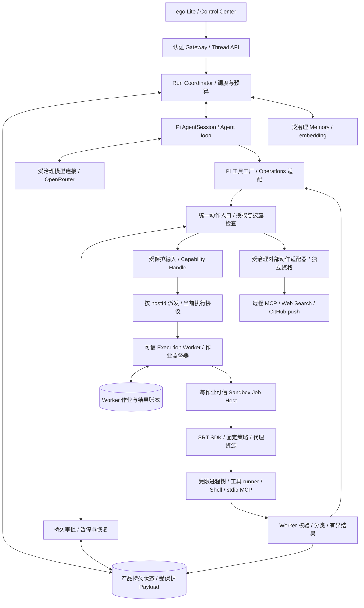
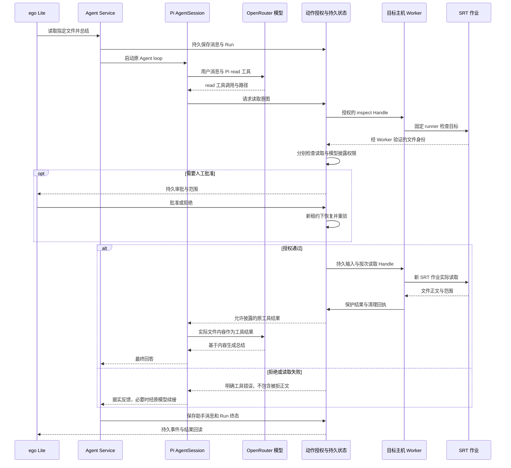
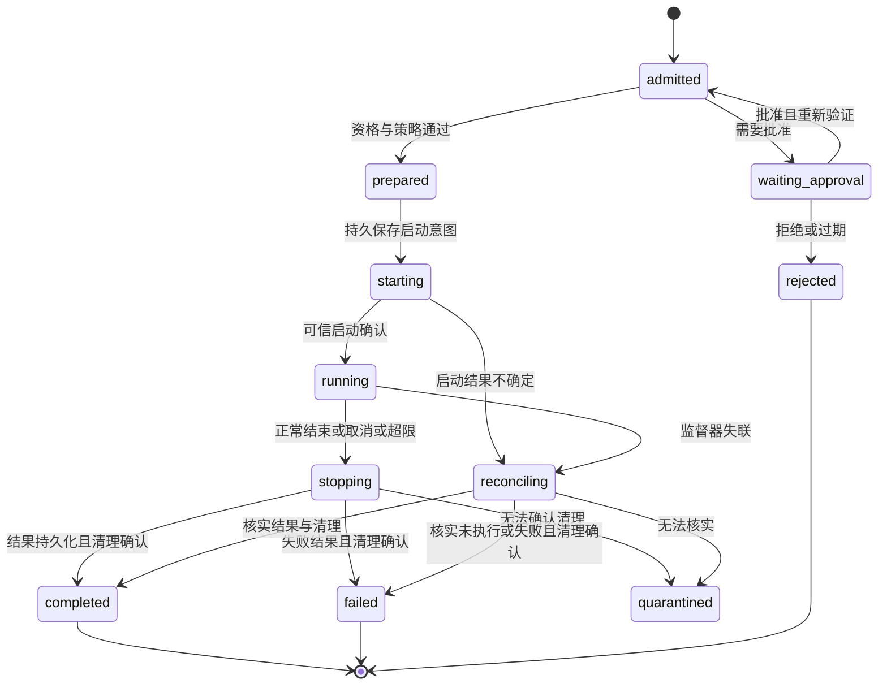

# SRT 统一执行架构设计

## 目标

让 Himawari 的 Agent 通过统一的产品执行入口使用文件、Shell、程序和本地 MCP，不在 Agent loop 或工具业务代码中分辨 macOS 与 Linux。由 Anthropic Sandbox Runtime（下称 SRT）实现受限进程启动，Himawari 管理授权、执行生命周期、持久恢复和输出披露，Pi 继续管理模型交互及工具循环。

本文是 2026-09-07 已确认产品范围的目标设计，完整执行链路尚未实现，也未取得真实主机资格。Owner 已否决先建设签名 Mac 文件访问 helper 的路线，要求改用 SRT；本文不把原生 helper、security-scoped bookmark 或 Apple container 安装列为新路线的前置条件。首批必须包含文件和编码工具、受限 Shell、MCP、授权联网、Web Search 及 GitHub 已有 commit 推送，默认直接操作已授权原项目。工程细节由实施与验证落实；已有代码与历史验收状态不因本文而变成 SRT 实现。

## 来源上下文

- 用户提供的完整集成指南：[Anthropic SRT AI Agent Integration Guide](../../assets/others/Anthropic_SRT_AI_Agent_Integration_Guide_2026-09-07.md)。原文作为输入保留；其中测试清单是要求，不是已通过证据。
- 当前架构：[SOURCE: docs/architecture-v0.1.md]
- Pi 与产品状态边界：[SOURCE: docs/adr/0001-pi-runtime-adapter.md]、[SOURCE: docs/adr/0015-product-state-over-pi-runtime-projection.md]
- 当前平台隔离路线：[SOURCE: docs/adr/0022-mac-tiered-command-sandbox.md]
- 保留的通用审批与恢复决定：[SOURCE: docs/adr/0023-durable-hitl-execution.md]
- 本设计的已采纳决定：[SOURCE: docs/adr/0024-srt-unified-execution.md]
- 原始真实文件总结验收：[SOURCE: docs/execution/specs/2026-09-07-real-file-summary-agent-loop-design.md]

### 已核对的上游边界

审查基线为 `@anthropic-ai/sandbox-runtime@0.0.75`，发布标签提交 `40804af`。官方仍标记 Beta Research Preview。设计审查阶段核对了固定标签的 README、包元数据、manager、配置、schema 和 Mac/Linux 后端源码。2026-09-08 的实施已固定安装该版本、加入候选策略编译，并通过 Mac 固定假数据的文件/网络拒绝探针；正式 Job Host、硬资源限制和恢复资格仍未完成，证据范围见配套 Plan。[发布记录](https://github.com/anthropics/sandbox-runtime/releases/tag/v0.0.75)、[README](https://github.com/anthropics/sandbox-runtime/blob/v0.0.75/README.md)

`SandboxManager` 有模块级配置与代理状态；`wrapWithSandboxArgv()` 产出启动描述，在 Mac/Linux 上仍包含 shell 语义，返回的 `env` 来自调用进程。其 `cwd` 参数目前不影响这两个平台的规则生成。`cleanupAfterCommand()` 清理辅助挂载文件；`reset()` 回收 SRT 自身资源，不能替代 Himawari 对整个任务进程树的终止证明。[manager 源码](https://github.com/anthropics/sandbox-runtime/blob/v0.0.75/src/sandbox/sandbox-manager.ts)

SRT 使用 macOS Seatbelt 与 Linux bubblewrap 等机制，不是 VM。`allowRead` 是被禁止范围中的读取例外，不是全盘默认拒绝的白名单。应用必须编译自己的保护目录与例外，并验证具体规则的优先级，不能照字段名称推断隔离保证。[配置源码](https://github.com/anthropics/sandbox-runtime/blob/v0.0.75/src/sandbox/sandbox-config.ts)、[Mac 后端](https://github.com/anthropics/sandbox-runtime/blob/v0.0.75/src/sandbox/macos-sandbox-utils.ts)、[Linux 后端](https://github.com/anthropics/sandbox-runtime/blob/v0.0.75/src/sandbox/linux-sandbox-utils.ts)

历史公告 GHSA-9gqj-5w7c-vx47 影响 `<0.0.16`，修复于 `0.0.16`；它说明空网络允许列表需要永久回归，不能据此声称 `0.0.75` 仍受该漏洞影响，也不能据此认定当前版本无其他问题。[安全公告](https://github.com/anthropics/sandbox-runtime/security/advisories/GHSA-9gqj-5w7c-vx47)

## 范围

包含整个产品的执行职责划分、Pi 接入、Worker 与 SRT 生命周期、文件/工作区、通用 HITL、Shell/MCP/外部 API、输出、资格、迁移及验收设计。首批包含文件读取、原项目内编辑/写入/搜索、受限 Shell、本地 stdio MCP 及受治理远程 MCP 接入、授权联网/依赖安装/下载、真实 Web Search 与 GitHub 已有 commit 推送。每类实际启用的适配器必须通过对应资格；第一批必需能力缺失时报告交付未完成，不能将其静默移为后续任务。认证浏览器自动化未因公共搜索需求而自动成为本批要求。

不重写 Pi AgentSession、Provider 协议或工具参数体系；不把 SRT 当作模型 SDK、远程 Worker 通信协议、权限数据库或系统安装器。本文不实施代码、不执行付费模型请求、不更改主机安全设置，也不声明已经能从浏览器完成真实文件总结。

## 验收标准

1. 同一产品工具请求可以按 `hostId` 路由到 Mac 或 Linux Worker，Agent 和应用服务不包含按 OS 分支的执行业务逻辑；平台资格差异返回稳定产品状态。
2. 所有模型可触发的宿主文件操作、工作区命令和 stdio MCP 都经过统一授权及执行入口。缺少适配或资格时不注册该能力，不能回退到裸 `spawn`、默认 Pi 本地 I/O 或原生 helper。
3. Pi 真实工具请求经过当前授权、一次性输入与凭证、SRT 作业、受保护输出，回到原工具调用；随后由同一个 Pi Agent loop 发起模型续接。
4. 文件读取与至少一种受控副作用工具共享审批、重启恢复、取消和结果核查；确认结果重放不执行，不确定结果不盲目重试。
5. 两个平台分别取得所启用 profile 的真实负向测试与生命周期证据，不能用一种 OS 的测试替代另一种。验收不要求二者同时上线，但可用性必须按主机和 profile 如实报告。
6. 通过 ego Lite 验证真实模型读取已知本机文件并总结、刷新回读、重启回读及失败反馈。文件正文必须来自本次 Worker 沙箱读取，不能提前上传替代工具调用。
7. 首批验证原项目内授权编辑、受限 Shell、MCP 工具调用、批准范围内的联网与依赖安装，以及真实 Web Search 的结果、页面核实和来源引用；已有有效授权不重复询问，高风险操作保留通用审批。
8. 在明确授权的 GitHub 验收仓库推送预先存在的 commit，确认远端分支指向预期 OID、commit 身份未改写，工作树未被顺带提交；拒绝、权限不足和结果未知均有明确反馈。该验收目标与凭据使用另行取得具体授权，本设计确认不是本次实际 push 指令。

## 设计

### 1. 整体架构与信任边界



这张图是目标架构。Agent Service、长驻 Execution Worker 与每作业 Sandbox Job Host 都是可信产品进程；只有最后的工具进程树处于 SRT 限制之内。Job Host 不加载工作区插件、不执行模型脚本、不携带模型或云端真实凭证。SRT 代理也在可信侧，必须受生命周期监督。

“统一运行时”指统一宿主执行合同。模型网络请求、产品数据库、身份校验和 Memory 仍属于可信控制路径，不能搬入会执行不可信代码的沙箱。外部 API 动作也从同一动作入口接受产品治理，但 HTTP adapter 的服务端副作用不能被宣称受到本地 SRT 隔离。

| 层 | 保留或新增的责任 | 不应承担的责任 |
|---|---|---|
| 浏览器与 Gateway | 身份、CSRF、消息、审批展示、持久事件与回读 | 生成沙箱配置、直接启动宿主命令 |
| Pi runtime | AgentSession、模型流、工具 schema、标准工具语义、工具批次 | 宿主授权、直接默认本地 I/O、恢复权威数据库 |
| 应用层执行入口 | 确定动作与目标、ALLOW/ASK/DENY、预算、Handle、结果披露 | 拼接 Seatbelt/bwrap 规则、OS 分支 |
| Execution Worker | 验证派发、一次性执行、作业监督、恢复核查、保护结果 | 把不可信 stdout 当作可信执行回执 |
| 每作业 Job Host | 干净环境、固定 SRT 配置、受限进程启动与 SRT 资源生命周期 | 自行批准扩权、与其他作业共享可变 manager |
| SRT | 平台文件/网络隔离规则及受限启动机制 | HITL、持久 exactly-once、全面资源配额、远程主机路由 |
| 平台适配与资格 | 依赖、路径布局、进程监督、实际隔离保证 | 让业务代码感知具体 OS，失败时静默降低保证 |

Mac 本机文件仍由 Mac Worker 执行。Hermes 上的 Agent Service 不能因为 SRT 跨平台就直接读取 Mac 路径。主机身份、配对、传输认证和 authority fence 继续沿用现有产品机制。

以“读取指定文件并总结”为例，目标时序如下；inspect 与 read 分别是权限固定的作业，未决审批保存在产品状态中，不要求保留活着的沙箱进程。



### 2. Pi 复用方式

固定 Pi `0.84.2` 提供 `ReadOperations`、`BashOperations` 及 edit/write/find/grep/ls 工具工厂。现有 `createGovernedPiCodingTools()` 强制传入 Operations，`createPiOperationsFromGovernedHostPort()` 已把 read/write/edit/bash 映射到产品端口；`executeGovernedPiRead()` 已用于目标 Worker 的读取格式处理。

保留这些路径。模型仍看到 Pi 的 `read(path, offset?, limit?)`、`bash(command, ...)` 等标准工具，不新增同用途的 `request_file_read` 或产品自建循环。模型提供的是操作意图；不能提供可信 host 绑定、策略正文、审批决定或自签执行凭证。

对于 read/edit/write 等复合工具，产品入口一次接纳完整工具动作，固定动作范围和 job，再在受限 runner 内复用 Pi 工具执行与 Operations。这避免 edit 的“读旧值—生成修改—写回”跨多个独立授权作业。底层 Operations 的多次 I/O 必须落在同一作业范围；格式化、offset/limit 与截断语义继续由 Pi 负责。runner 可调用 `packages/runtime-pi` 的导出，不在其他包直接导入 Pi。

现有 host Operations 只覆盖四类工具。find/grep/ls 必须补齐对应受治理 Operations，搜索器启动也在同一作业内；不能因为有工厂就启用默认实现。Shell 工具保留批准的 shell 文本语义，文件工具只传类型化数据，不将路径拼入 shell 文本。

工具定义与 runner 在注册时绑定相同工具版本及参数语义。已有读文件正文大小、文本类型、目标身份验证仍先于 Pi 的展示截断；不因复用 Pi `readFile` 的全量 Buffer 接口而取消产品读取上限。

### 3. 一个应用入口，一个宿主执行端口

在现有 `RuntimeToolPort`、动作授权、Capability 与 Worker 流程上统一调用，不在旁边建立第二套工具注册、审批或结果仓库。目标新增的 `SandboxExecutionPort` 是产品内部宿主执行端口，`packages/execution-contracts/src/sandbox-execution-v1.ts` 已定义严格的产品作业计划、身份、回执及观察校验；`packages/application/src/ports/sandbox-execution.ts` 已定义 prepare/start/observe/cancel/reconcile 端口。当前已有候选 SRT 策略编译及 SQLite 作业观察适配，但没有正式 Worker/SRT 执行接线。下表中未对应导出的概念仍属后续设计，不表示所有名称都已成为 API。

| 合同 | 核心内容 |
|---|---|
| `ExecutionIntent` | Owner/Agent/Thread/Run/toolCallId；动作类型与参数摘要；hostId；文件/工作区引用；模型披露目标；原始期限 |
| `AuthorizedExecutionPlan` | intent 摘要；授权记录及 epoch；Handle/inputRef；逻辑 invocationId 与 attemptId；工具版本；profile 版本；runtime/runner 摘要；worktree 基线；权限语义摘要；到期时间及资源上限 |
| `CompiledSandboxPolicy` | Worker 按本机路径编译的 SRT 配置；编译器版本；配置 hash；环境模板；qualificationRef；实际可提供的保证集合 |
| `SandboxJobReceipt` | jobId/attemptId/hostId；计划和策略摘要；可信开始/结束状态；exit 信息；受保护输出引用及摘要；清理状态；已知副作用与待核查原因 |

产品授权批准的是确定的权限语义。Worker 可以将其解析为本机绝对路径，但不能扩大范围；将语义摘要、编译结果和资格绑定后才能执行。不让远端 Agent 直接写 Mac/Linux 的 SRT JSON。

`SandboxExecutionPort` 提供完整的 prepare/start/observe/cancel/reconcile 生命周期，并显式报告资源清理结果。只返回 `{command,args,env}` 的旧 `createLaunch()` 合同不足以管理 SRT 的存活代理、初始化异常和孤儿任务，不能只换这个函数的返回命令就算完成迁移。

主机监督器是启动不可信树的唯一所有者。stdio MCP 不再由另一处 `StdioClientTransport` 独立拥有进程；复用已固定 MCP SDK 的协议逻辑，通过受监督的 stdio 传输薄适配接入。不得重写 MCP 协议，也不得把终止问题交给 `client.close()` 后就宣告整个树已结束。

### 已实现的合同与按次绑定基础

`SandboxExecutionPlan` 从既有 `FrozenCapabilityInvocationReceipt`、`RuntimeRequest` 和已接纳的 `RuntimeToolInvocation` 投影。`createSandboxExecutionPlan()` 检查 Owner/Agent/Run、Thread/model、租约版本和 authority fence；复用现有 `runtime-tool:sha256([runId, toolCallId])` 标识核对 receipt 与 inputRef，拒绝跨调用替换；取 Run 原期限、Handle 有效期与调用期限的最小值，资源上限不能扩大。摘要实现由可信平台提供；`semanticFingerprint` 保留既有持久凭证的 `sha256:` 前缀。该函数不签发权限，不用 TypeScript 对象代替 Worker 对当前权限与受保护输入的重新核验。

接纳后的 `toolCallId` 可以是现有文件工作流产生的 inspect/read 子调用 ID；它与原始 Pi 工具调用的父子关系继续由工作流及受保护 scope 保存。SRT 作业不得自行修改父子关系，也不能把一个子调用的 Handle 用于另一个阶段。Worker 的 job/attempt 与 Capability invocation 分开：同一次准入不能因为换 attemptId 再消费一次或自动启动第二次。

Pi `createGovernedPiCodingTools()` 新增互斥的 `operationsForCall` 绑定方式：每次 `execute` 从 Pi 实参取得 toolCallId，在可信闭包内获取本次 Operations；不把模型参数传作身份或授权，不使用全局可变当前调用。保留已有 `operations` 方式供已按单次 Worker 调用构造的适配和工具定义复用；多调用生产工具应使用按次绑定。异步绑定前后检查取消。模型 schema 和工具执行仍由固定 Pi 工厂提供；复合 edit/write 的多次 I/O 共用本次绑定。正式 runner/生产工具的迁移在后续阶段完成。

作业观察校验只约束现有持久账本将要保存的事实，不建立新 Agent 状态机。它拒绝身份/策略更换、序号重放、完成后再次启动及未知副作用自动重放；只有确认清理且副作用可核实的结果才能进入 completed/failed。隔离槽位可以进入 reconciling 后继续核查，不能直接恢复执行。重复读取已有同一回执是读操作，不应伪装成新 sequence。恢复、取消、费用与模型调用次数仍归 Run/Handle/现有模型账本管理；资源天花板由当前 Capability 回执投影。SQLite 作业账本已通过追加迁移实现序号 CAS、启动前权限同事务复核、观察重放及待核查分页；终态输出必须对应已持久化的 invocation 结果。它不签发主机资格，也不替代真实清理证明。`SandboxJobJournalPort.admit()` 将既有凭证消费与首条作业记录放入同一 SQLite 事务，凭证摘要由消费结果生成；建账失败回滚 Handle 消费。独立的准备写入口不可调用。旧/重放凭证没有作业记录时属于执行未知，直接拒绝准入，不得补建并启动。正式监督器必须使用这一原子入口，并完成 scope 与资格检查。Worker 通信、Job Host 与真实恢复接线仍待实现。

### 4. 作业生命周期与 SRT SDK 接入

一个 Run 可以包含多个模型轮次、工具调用和沙箱作业；一个作业对应一次权限固定的执行尝试。Execution Worker 长驻，每个作业启动一个新的可信 Node Job Host；第一版同一工作区串行，作业之间不共享 manager、HOME、tmp 或缓存。

执行顺序固定为：

1. Worker 验证 authority fence、当前授权、Handle 使用次数、受保护输入、资格和原始期限，先持久保存启动意图及 attempt 身份。
2. 为本作业创建私有 HOME/tmp/cache 和所有权清单。实际宿主 home、控制目录、其他任务目录由可信安装信息提供，不能从新的 HOME 推断。
3. 以固定绝对 cwd 和环境白名单启动 Job Host，再在这个独立进程内载入 SRT。禁止继承完整 `process.env` 后才删几个秘密变量。
4. 严格产品 schema 拒绝未知键、占位符、相对路径和禁止开关，再经过 SRT schema。检查平台与依赖，关键 warnings 同 errors 一样阻止执行；初始化后、启动前确认代理与规则准备完成。
5. 只调用一次 `initialize()` 配置该 manager，不传自动批准回调，不开放 `updateConfig()` 或每命令扩权覆盖。用 `wrapWithSandboxArgv()` 生成启动描述，监督器按返回 `argv/env` 及已验证 cwd 启动，外层 `shell:false`。
6. SDK 接收的 command 仍有 shell 语义。固定 runner 使用经验证的参数编码或引用方案，结构化请求经有界 stdin 传入；通用 bash 才执行原批准 shell 文本。禁止 `args.join(' ')`。固定 PATH、shell 和 runtime 安装位置，禁止使用工作区内的可变执行文件作为可信启动器。
7. 监督运行与输出、处理取消和期限，确认不可信进程树及其管道结束后，调用 `cleanupAfterCommand()`、`reset()` 并监督 Job Host 退出。
8. 持久保存输出和完成回执后回传。清理无法确认时隔离作业槽位并保留证据；不能删除目录掩盖存活进程，不能报告正常完成。

准备、运行、清理各有独立上限，并受 Run 总期限约束。达到业务期限必须立即进入停止流程；清理使用单独有界应急窗口，不能为了“已经超时”而放弃回收，也不能恢复用户执行。`Promise.race`、只 kill 一个 PID、只杀进程组或只调用 SRT reset 都不能单独证明后台、重新建会话的后代已经终止。

父 Worker 监督 Job Host，Job Host 监督 SRT 辅助进程和任务树。资格必须包含 Job Host/Worker 异常退出、后台子进程、继承管道及重新建会话的情形。若平台监督手段不能证明所需保证，该 profile 不可启用；不得把 SRT 并不提供的硬 CPU/内存/磁盘限制写成已实现。平台可以提供额外、可验证的限制适配，但不引入业务层 OS 分支或未批准的隔离回退。

### 5. 文件和工作区：两种范围，共用 SRT

| 产品 profile | 用途 | 授权与执行限制 |
|---|---|---|
| `host-readonly.v1` | 读取用户明确授权的宿主文件 | 固定类型化 inspect/read runner；指定主机和目录内对象；正文大小限制；无任意 shell；无用户文件写入；默认阻断受控网络出口 |
| `authorized-project.v1` | 原项目中的读取、编辑、搜索、构建与测试 | 默认使用已授权原目录；按读写权限执行并保留已有修改；私有 HOME/tmp/cache；产品控制目录与机器秘密不开放；离线/授权联网作为显式网络策略 |
| `isolated-workspace.v1`（可选） | Owner 选择隔离候选时的代码任务 | 独立副本/worktree；导入和写回单独授权；不替代默认原目录行为 |
| 授权联网策略（首批） | 依赖安装、下载及联网工具 | 为上述执行范围冻结允许目标和端口、外发数据与预算；通过对应资格；不以允许一个域名推断允许所有 API 操作 |

这些是 Himawari 的产品 profile，不是 SRT 自带名称。“离线”必须在资格中分别描述 TCP/HTTP/SOCKS 与系统 DNS 行为；要求绝对零外联的动作只有在所有所需出口都被证明阻断时才能执行，不能用 profile 名称掩盖 macOS DNS 差异。

保留 P007–P009 的两阶段 inspect/read。第一阶段只授权必要的元数据检查，固定 runner 不读取正文；第二阶段绑定实际文件身份、读取权限及模型披露权限，再签发读取 Handle。SRT 文件读限制不等于元数据专属权限，因此第一阶段还依赖被固定和验证的 runner 行为，不能允许模型把它替换成任意脚本。

应用层先校验 host/grant/path，受限 runner 内再次使用现有 `HostFileReadService` 与约束文件访问机制校验目录、普通文件、符号链接、设备/inode 等预期身份和大小。读时重新检查身份；路径归一化或上一次 inspect 不能替代使用时检查。权限被撤销、文件替换或目录变更后拒绝执行或重新申请，不能沿用旧结果假设。

策略编译器保护整个真实用户数据区域、Himawari 控制/秘密目录、其他作业及相关挂载路径，再增加这次动作的最小读取例外。系统工具链仍有必要可读范围；本设计不声称 SRT 默认只看得见一个工作区。保护集必须记录覆盖范围，未知挂载或无法满足隔离要求时拒绝相应 profile。机器秘密不以扫描输出替代访问阻断。

不用 glob 作为跨平台新文件保密的主要机制。授权原项目时明确排除秘密子树，保护 `.env`、Himawari 运行配置及未授予写权限的 Git 元数据；不能因为直接编辑就开放整个 home。Git 操作需要的元数据权限按动作单独授予，普通编辑不自动取得任意修改 `.git` 的能力。规则嵌套冲突必须在两种 OS 验证。显式封住 SRT 默认共享写路径，包括 `/tmp/claude` 及 Mac 对应路径；私有 `HOME`、`TMPDIR`、`CLAUDE_CODE_TMPDIR` 使用可信值。

读取原文件不要求先复制正文到 Agent Service。默认编码直接使用已授权原目录：启动前识别已有修改，写入前检查版本与重叠冲突；同一项目的 Agent 写作业串行，仍须考虑用户或其他程序同时修改，不能用本方锁假定独占文件。已有有效目录授权覆盖的普通编辑不重复询问。删除等命中高风险策略的动作须确认；被批准脚本可能删除文件时必须按其实际副作用授权，不能只拦截工具名中的 delete。无法机械保证只读或不删除的任意命令不能伪装成低风险动作。

独立工作区仅在用户选择或明确的隔离候选场景使用。需要副本时，导入、归档、解包、Git 命令均作为受治理执行处理；不让可信 Worker 裸执行受用户仓库配置、hook、过滤器或压缩包内容影响的工具。导入应限制 symlink、硬链接、特殊文件和跨目录条目，不与原项目共享可写 `.git`。

默认原项目模式下，普通修改按现有目录授权执行；重要覆盖、删除和权限扩张依照对应高风险规则展示范围并确认。可选副本的写回及产物导出是独立动作，校验基线与目录身份，不能把临时目录权限当作原目录权限。失败或取消时报告原项目可能已有的修改，禁止自动 reset/checkout 覆盖用户变更；需要恢复时校验当前版本并按可恢复记录处理。

### 6. 通用 HITL 与持久执行

沿用 ADR 0023：Run 的持久 checkpoint、受保护 Pi continuation、审批请求、Handle 和执行结果账本仍是权威。SRT 作业状态是这个模型下的资源执行子状态，不建立第二个 Agent 状态机。



图中的 completed/failed 表示作业结论，不能直接等同 Run 的最终成功/失败；例如读取失败可以作为工具结果交给 Pi 解释，取消 Run 则阻止后续模型调用。quarantined 不会自动迁回 prepared，必须先完成明确的清理及结果核查。

审批页面展示动作、host、文件/目录/工作区、命令或操作摘要、网络目标、外发数据类别、将使用的模型、权限差异、到期时间及重试语义。审批绑定原 toolCallId、语义摘要、策略版本和原期限，不能成为“允许任意后续命令”的按钮。

执行前 ASK 时不启动 SRT 作业。运行中出现缺少权限，只把 violation 作为诊断线索，先停止并确认清理、记录已发生的副作用，再为具体权限差异走通用审批。日志不是授权请求本身；模型也不能要求“忽略限制再跑”。批准后新建 Job Host 和新策略，不修改旧 manager。

批准不会证明之前命令没有副作用。读操作可以在明确重试规则下重新读取；删除、Shell、发邮件及 MCP 必须各自声明幂等键、结果核查或禁止自动重试。已确认结果从账本回读，启动过但无结果的操作进入 `reconciling_external_result`，不因浏览器刷新、重启或重新批准再次派发。

暂停保存当前模型身份、参数、工具批次和总期限；恢复沿现有 Pi 历史适配执行，不重放真实模型请求。权限、部署或策略变更后重新验证；不能通过恢复重置时间、费用、调用次数或授权 epoch。等待期间释放运行槽位，存在未知清理的槽位则隔离。

### 7. 网络、MCP、浏览器与秘密

| 操作类别 | 目标执行路径 | 开放条件 |
|---|---|---|
| Pi 文件/代码搜索/解释器/依赖安装 | 统一动作入口 → Worker → SRT | 首批；profile 与实际工具链均通过资格；安装脚本按不可信代码处理 |
| stdio MCP | 同一 Worker 监督的 SRT 进程，复用 MCP 协议客户端 | 首批；固定服务身份、映射工具、逐动作授权、输出和进程监督；不跨任务共享常驻 server |
| 远程 MCP、GitHub push；其他云 API 按需接入 | 同一动作入口 → 受治理外部 adapter | MCP 与 push 首批；服务及动作白名单、披露/凭据/幂等/核查合同；SRT 不提供远端权限控制 |
| Web Search、页面打开、下载 | 现有 Web 服务和狭窄 HTTP adapter；不可信下载工具走 SRT 授权联网 | 首批；真实搜索 provider、查询披露、SSRF、重定向和来源记录；可信 adapter 不能变成任意代理 |
| 浏览器自动化 | 后续专用、隔离会话的执行适配 | 不开放宿主日常浏览器调试口、Cookie 和本机任意 socket；未验证前不注册 |
| ego Lite 作为产品前端 | 正式 HTTPS/本机入口 → Gateway | 普通 UI/API 身份与 CSRF；不需要因 SRT 而迁移浏览器 |
| 模型、embedding、JWKS、产品仓库 | 可信控制路径的既有适配器 | 明确服务身份、秘密来源与披露；不接受不可信代码任意 URL 或命令 |

无授权时网络策略拒绝目标；首批必须提供可实际使用的授权联网，冻结 domain:port、数据披露及预算，已有有效授权直接继续。依赖安装可能包含重定向、镜像和安装脚本，授权应展示实际范围，新增目标不能自动扩大。禁止自动开放 localhost、Unix socket、Apple Events、SSH agent 或 Docker socket。HTTP 方法/路径限制不能只依赖 SRT HTTP filter，因为不同传输可能有不同覆盖；需要狭窄 API 语义时使用产品 adapter。DNS、内网地址、云元数据、重定向和连接撤销都属于首批相应网络路径的验收。

普通 Job Host 和不可信子进程不给模型密钥、通用云凭据及原宿主环境。搜索凭据由可信 provider adapter 使用；GitHub push 仅向专用传输委托按仓库收窄的凭据，见下文。SRT 产生的代理环境要保留，但不得继承未批准的上游代理设置。首版不依赖通用凭据 mask、TLS 终止、外部代理替换和弱化选项来承诺保密；不能以“遮蔽通常有效”作为真实秘密可交给任意进程的依据。

现有 `QualifiedCommandSandbox` 可以把批准的 secret bindings 解析为子进程环境；这项行为不能无声迁入 SRT。普通命令的任意真实凭据注入不因本次 GitHub 推送需求而获准，必须由原授权记录识别受影响调用方；首批 GitHub 推送通过专用动作满足，不延期为“以后才支持凭据”。既有 CPU、内存、时间等 ceiling 也必须逐项匹配实际保证，不支持时拒绝，不能悄悄忽略字段。

#### 首批 Web Search

复用现有 `WebCapabilityService.searchPublic/openPublic/buildResearchCitations`、`BoundedPublicWebAdapter` 和 `WebSearchProvider` 端口。核对的 Pi 标准 coding tools 为文件与 Shell 工具，不能把 provider 中出现的 WebSearch 名称当成已经可用的搜索实现；模型侧通过 Pi 工具注册薄适配使用产品已有 `web.search_public`、`web.open_public` 语义，不重新实现搜索引擎或 Agent loop。

首批必须选择并配置一个真实 provider，核实费用、凭据来源、超时/取消与查询披露。搜索结果包含标题、URL、摘要、排序和查询时间；对支撑回答的页面按需打开，记录抓取时间、原文可获得的发布时间和片段来源，不把搜索摘要当作已读全文。提供方、凭据与测试预算是实施配置待办，不是将 Web Search 移出首批的理由。无结果、额度耗尽或搜索失败均据实反馈，不回退为模型编造结果。页面内容和工具返回按不可信数据处理。

#### 首批 GitHub 已有 commit 推送

Owner 要求的是可完成 push 的产品效果，不要求向通用 Shell 暴露 token。采用 **Pi 原有 `bash` 入口的薄适配与服务端专用 push 动作**。这里的“专用动作”指产品内部的授权与执行语义，不要求新增模型可见的 `github_push` 工具。2026-09-07 的本地兼容性验证已证明原有工厂及 Operations 能承载这条调用路径；该结果支持入口选择，不表示正式执行链路已经实现。

目标调用顺序为：`Pi bash → createPiOperationsFromGovernedHostPort → 绑定当前调用的产品执行端口 → 通用授权与 durable HITL → Worker 受控 Git 适配 → 标准 Git 客户端 → GitHub`。Pi 继续负责工具参数、工具结果和 Agent loop；Himawari 负责权限、凭据、执行与恢复。授权对象冻结 owner/repo、远端身份、目标 branch/ref、已有 commit OID、待发送对象范围、预期远端状态和披露权限。以 OID 而不是可变 HEAD 作为批准对象；不顺带暂存、创建或改写 commit。默认不强推、不删除远端分支、不 mirror、不顺带推送其他 refs，遇到分支保护或非快进拒绝明确反馈。

首批支持明确的单条推送意图，例如 `git push origin <OID>:refs/heads/<branch>`。模型仍使用 Pi 的 `bash` 参数；产品在受信入口将受支持的完整命令解析为类型化意图，不能靠字符串前缀、PATH 中替换 `git` 或允许 Shell 执行剩余字符串来控制权限。`HEAD` 等可变引用如获支持，必须在授权前解析并冻结为 OID；暂不支持的语法明确拒绝，不回退到带凭据的 Shell。普通 Shell、依赖安装脚本与 MCP 内部执行的 `git push` 不因此取得传输凭据或调用可信凭据通道的权利。正式 SRT 资格必须证明这一点，不能以本地测试中的精确命令比较代替。

当前 `GovernedCodingOperationsPort.executeCommand` 接收 command、cwd、signal、timeoutMs、environment 与 onData，不含 toolCallId。正式接入必须由现有工具调用分派层构造绑定 Owner/Agent/Thread/Run/toolCall 的执行上下文，或在产品端口上显式扩展并迁移调用方；不能从模型命令或环境变量推导身份，也不能复用一个可变的“当前调用”全局对象。审批暂停、恢复与未知结果使用 ADR 0023 的通用状态机，不在 Git 适配中另写持久状态机。

保留 `packages/integration-github` 的在线监控只读规则，另建写动作授权与凭据作用域，不能修改只读权限常量来“顺便支持 push”。凭据端口不绑定单一认证供应方；先核实可复用的 host secret source 及其作用域，GitHub App 安装 token 是可按仓库收窄的实现选项，不把创建 App 设为用户推送的必经步骤。已有 `gh` 登录或其他来源能否复用，须验证其权限、有效期和专用传输委托方式，不能直接把宿主 token 交给普通 Shell。按 ADR 0024 的约束向专用传输提供最小权限、短期委托；现有来源不能满足时不可无声放宽。已有 App 如果只有 read 权限，创建更高权限的安装或更改账户设置需要针对具体对象授权，不从当前设计确认推导。GitHub 官方支持安装 token 用于基于 HTTP 的 Git，并允许签发时进一步限制仓库和权限；token 本身不表示产品已批准某个分支或 commit。[GitHub Git 权限](https://docs.github.com/en/apps/creating-github-apps/registering-a-github-app/choosing-permissions-for-a-github-app)、[安装 token](https://docs.github.com/en/apps/creating-github-apps/authenticating-with-a-github-app/generating-an-installation-access-token-for-a-github-app)

源仓库解析和对象导出在无凭据的受限作业中完成，固定对象集合及摘要；专用传输使用私有受控 Git 数据目录和受监督的 Git 客户端，不加载源仓库 hook、配置、任意 credential helper 或可变工作区程序。只有该传输可通过可信凭据通道获得委托，普通任务不能复用该通道；凭据不放进 URL、参数、源仓库配置或持久日志。使用成熟 Git 客户端，不另写 Git 网络协议；Git 进程同样受 SRT 与 Worker 生命周期管理，具体凭据传输和进程隔离在实施中验证。

执行前复核目标、权限、远端及已批准 OID，分支保护或需要附加权限时明确阻止而不绕过。结果不明先查询远端 ref 与祖先关系：已应用的对象不再重推，不能仅以当前 tip 不等于目标就认定失败；已确认未应用后才能按原意图和当前授权重试。远端并发变化引起语义冲突时重新核查，不自动升级为强推。实际仓库、分支、commit 和费用/凭据授权在真实验收前具体确定。

##### Pi/Git 本地兼容性证据与边界

可复跑测试：`packages/runtime-pi/test/governed-git-push.compat.test.ts`。测试使用固定依赖 Pi `0.84.2` 的真实 `bash` ToolDefinition、现有两层适配、系统 Git 客户端、临时 bare 仓库及本地 `git http-backend`。随机假凭据仅用于该 loopback 服务，不读取宿主登录或连接 GitHub。通过以下命令执行：

```sh
npm run check:pi-compat -- packages/runtime-pi/test/governed-git-push.compat.test.ts packages/runtime-pi/test/governed-host-operations.compat.test.ts
```

2026-09-07 本机验证采用 Node `22.22.3`、Git `2.47.1`，上述命令的 18 项测试通过，其中 Git 实验 16 项、产品端口回归 2 项。Pi compatibility 全组 58 项通过，类型检查、此次代码的 Biome 检查和依赖边界检查通过；不表示全仓其他文档与覆盖清单已通过检查。检查内容包括：

- 实际 HTTP 认证、指定 OID 推送、远端文件正文与唯一目标 ref、保留本地未提交修改，以及安全文本返回原 Pi 工具调用。
- 缺少执行或披露许可、调用前取消时，凭据使用与 HTTP 请求次数均为零。
- 凭据读取命令、环境打印、其他仓库或分支、强推 refspec、mirror、命令串联及未支持的调用形式不进入专用传输。
- 审批对象固定后修改 origin、推进 HEAD、设置源仓库 hook 和 URL 改写、传入恶意 Git 环境变量，仍只推送固定对象；其他仓库不变，源 hook 未运行。
- 远端存在更新 commit 时，标准 Git 拒绝非快进，远端 tip 保留，不自动强推。
- 修复现有适配器的超时单位错误：Pi 秒数转换为产品毫秒；非法值在调用产品端口前拒绝。原先 10 秒被传成 10 毫秒时成功路径失败，修复后通过。

这是一项测试内的执行适配原型：授权与披露用布尔开关表达，源对象导出由测试准备，结果确认直接读取临时远端，尚未接入真实权限仓库、审批恢复、Worker、受保护 Payload 或远端查询适配。假凭据只交给专用 Git 子进程的环境，输出只返回确认摘要；没有证明同一用户的其他进程不能读取该环境。测试不启动通用 Shell，因此拒绝 `env`、`git credential fill` 证明的是这些请求没有进入凭据通道，不是任意沙箱程序都无法窃取凭据。

正式交付仍须验证不可信仓库对象导出、SRT 文件和进程可见性、可信 IPC 访问限制、网络重定向和凭据来源、真实 GitHub 分支保护，以及断连、重启、并发和取消后的远端结果核查。本次未调用真实模型；Pi 工具可以调用该通道不等于模型会稳定选择受支持命令，也不替代 ego Lite 最终验收。当前选择薄适配；只有后续证据证明它不能满足这些要求时，才记录具体缺口并评估独立模型工具，不预先建设第二套工具体系。

Pi 扩展、插件或 MCP 服务发现不得从任务可写目录动态载入可信 Agent 进程。声明性资源仍复用 Pi loader，但其来源与披露由产品约束；可执行扩展只允许受信部署包，其他代码先走沙箱适配资格。否则仅隔离 bash 仍可绕过执行边界。

### 8. 输出、资源与可观察性

stdout/stderr、文件产物、MCP 文本和 violation 消息都是不可信数据。监督器施加单流及总字节上限、背压和截断元数据，停止输出洪泛与保持管道打开的任务。可信回执只能由监督器产生；child 不能凭 stdout 中的 jobId、status 或 resultRef 冒充成功。

Worker 将正文、来源、实际读取范围、截断状态、内容摘要和失败原因保存到受保护 Payload。产品继续执行分类、机器秘密排除与模型披露检查；只有对应 Run/model/toolCall 的允许内容进入 Pi 下一轮请求。拒绝披露时不得发送正文；源文件中的指令不能改变授权或系统提示。

审计串联 `Run → toolCall → approval → Handle → invocation → attempt → job → policy/qualification → result`。公开诊断只显示安全错误码、范围摘要和计数；敏感路径、命令与正文按权限保护，秘密不能进入日志、截图或测试报告。真实模型用量沿原账本累计，重放历史工具消息不记作新外部请求。

### 9. 代码迁移映射

| 当前入口/模块 | 目标处理 |
|---|---|
| `apps/agent-service/src/production-runtime-tools.ts`、`production-file-read-workflow.ts` | 保留动作/授权/披露和两阶段读取，抽出供其他工具复用的动作接纳流程；不感知 SRT SDK 或 OS |
| `packages/runtime-pi/src/governed-coding-tools.ts`、`governed-host-operations.ts`、`governed-read-executor.ts` | 复用工具工厂和 Operations；补齐需要的工具映射及 runner 导出；禁用所有默认本地执行 |
| `packages/application` 的 HostFileReadService、RunCoordinator、RuntimeContinuationService | 保留文件不变量和 durable HITL，新增产品执行生命周期端口及作业语义，不引入 SRT 类型 |
| `packages/platform-node/src/capabilities/isolation.ts` 的 launch-only 合同 | 迁移为完整 SandboxExecutionPort 适配与监督；新路径不使用 Mac helper 占位实现或自建 bwrap 策略 |
| `packages/platform-node/src/capabilities/node-capability-runtime.ts` | program 和 stdio MCP 共享监督启动与清理；HTTP 分支明确作为受治理外部动作 |
| `packages/platform-node/src/workspaces` 的 QualifiedCommandSandbox、Mac router、Linux/Apple provider | 编码命令统一进入同一执行端口；新资格替代旧 tier 路由后移除无调用方的旧后端，禁止永久双路维护 |
| `candidate-workspace/qualified-candidate-workspace.ts`、`workspaces/git-workspace-adapter.ts` | 审查 Git、archive、tar、apply 等宿主命令；受不可信仓库/产物影响的执行纳入相应 import/export job |
| `apps/execution-worker/src/production-worker-composition.ts` | 组合统一监督器、作业恢复与能力资格；平台分支下沉至基础设施适配 |
| 拟新增 `packages/runtime-sandbox` | 唯一直接依赖固定版本 SRT 的包；暴露产品类型适配，运行于每作业 Job Host；不成为第二套 Agent runtime |
| 拟新增 Worker 的 `sandbox-job-main` 安装入口 | 用独立受信 Node 进程加载 runtime-sandbox，处理固定 IPC 协议；启动环境和 IPC 不传入不可信子进程 |
| `packages/platform-node`、`packages/persistence-sqlite` 的执行账本 | 在已有 invocation/结果权威上扩展 job/attempt、清理与核查记录，增加迁移和并发 fence 验证 |
| `packages/integration-web`、`WebCapabilityService` 与生产工具组合 | 复用搜索/页面端口与引用记录，补齐真实 provider、Pi 工具薄适配、披露、预算与生命周期，不以 fixture 验收 |
| `packages/integration-github` 的只读能力与 host secret source | 只读监控保持原约束；新增独立 push 动作与专用传输、按仓库凭据、OID 绑定及远端结果核查 |
| Capability deployment、CommandProfile、资格记录 | 引入版本化 SRT runtime/profile/compiler 身份；不能把旧 `sandboxTier` 或 Linux binding 直接重标为 SRT |
| 安装产物与边界检查脚本 | 固定包与辅助文件完整性、Job Host 入口和依赖归属；禁止产品其他包直接导入 SRT |

这张表来自当前相关源代码及 spawn/execFile/fetch/MCP 入口检查，不声称已完成全仓库动态绕过证明。实施时必须将所有模型可达调用方逐项登记为沙箱执行、狭窄可信动作或禁用。主机 secret source 的受信 Keychain 调用、产品状态文件 I/O 等不因使用同名系统 API 就自动归入不可信执行。

### 10. 分阶段迁移与兼容

| 阶段 | 设计交付门槛 | 原待办的关系 |
|---|---|---|
| A：执行合同与资格模型 | 按已确认范围核实完整调用方；确定各 profile 保证、作业协议与数据迁移 | 修订 P011 的执行基础，保留 P001–P009 的行为验收 |
| B：受监督 SRT 作业 | 每作业进程、严格策略、干净环境、输出限制、清理及未知结果；真实 OS 最小探针 | P011 与 P1-01 的基础；尚不能勾选整个真实文件流程 |
| C：现有读取迁移 | inspect/read 都由正式 Worker 的 SRT runner 执行；两阶段授权、保护结果与 Pi 续接 | P007–P014 的相关回归；P010 沿原通用状态机扩展 |
| D：通用工具、联网与外部能力 | 原目录 edit/write/bash/代码搜索、受控删除、本地与远程 MCP、授权联网、Web Search、专用 GitHub push；审批和不确定结果测试 | 都属于本批必需范围；通用 HITL 的多工具验收，不能以 read 成功代替 |
| E：产品入口及交付 | OpenRouter 真实调用、ego Lite、刷新和重启；真实搜索和指定 GitHub 仓库推送；费用与安全证据；文档与安装资格 | P1-02–P1-05、P2-01–P2-02 加本轮新增产品验收 |

每一阶段只有通过实际门槛才能更新旧待办，新增设计文档不改变完成勾选。Owner 已确认首批范围，对应文件级 Implementation Plan 见 [SOURCE: docs/execution/plans/2026-09-07-srt-unified-execution-plan.md]；本节是同一批交付内部的依赖次序，不是将联网、MCP、搜索或 push 延期。

数据库迁移保留已完成 Run、审批、Payload 与旧执行结果；结果回读不需要旧后端再次执行。新增运行绑定有独立 schema/version，旧 hostIsolation 与 CommandProfile 不自动换成新权限。切换时停止旧执行准入，核查在途作业，确认清理后才启用同一主机的新执行资格。

待审批 Run 保留原 Pi continuation、模型身份、动作和期限。若新执行绑定改变审批语义，按当前权威重新申请或明确阻止恢复；不得把旧审批直接解释为新的 SRT 扩权。失联任务先核查，不自动迁往另一台主机重做。升级/回滚不复活取消或过期任务，也不能回滚到已知不满足安全要求的版本。

ADR 0024 已 accepted，统一承接 ADR 0021 和 ADR 0022 的当前替代关系；历史上 0022 替代 0021 的过程保留在原正文与历史引用中，ADR 0023 继续生效。该状态是决定已采纳，代码仍待迁移。受影响的安装、恢复、迁移 Runbook 要在实际合同和运行验证完成后重新封存，不能仅为通过摘要检查而改 seal。

## 错误处理

| 类别 | 产品行为 |
|---|---|
| `approval_required` | 保存通用暂停点；未开始的动作不启动作业；已有有效授权不重复询问 |
| `permission_denied` / `disclosure_denied` | 拒绝对应动作或外发；不读未授权正文，不向模型发送被拒正文 |
| `sandbox_unavailable` / `qualification_failed` | 明确指出主机/profile 不可用；原始命令不运行，不使用旧后端回退 |
| `policy_invalid` / `policy_blocked` | 无效策略不启动；运行阻断记录实际结果，不能假定此前无副作用 |
| `target_changed` / `not_found` / `not_regular_file` / `input_too_large` | 返回可理解的文件结果，不以空文本冒充完整读取 |
| `program_failed` / `output_limit` / `timed_out` / `cancelled` | 终止并清理，保存明确状态和截断信息；Run 取消后不继续模型请求 |
| `result_unknown` / `cleanup_unknown` | 持久核查或隔离槽位；不自动重放，不发布未经确认的成功 |

这些是目标错误分类，实施时映射到现有合同并版本化新增字段，不并行维护两套同义错误体系。

## 验证策略

设计阶段的源码核对不能替代以下实际验证。测试编号以用户指南的章节为命名空间，避免与原 P0-01 等产品待办混淆。

| 验证层 | 必需证据 |
|---|---|
| 产品合同与 Pi 兼容 | Pi 参数/结果与原工具批次恢复；每动作授权和披露；过期/取消/预算；已确认结果不执行；未确认副作用不重放 |
| 指南 §13.2 的 P0-01–P0-10 | 正常文件操作，假秘密/控制目录/其他任务保护，嵌套拒绝、越界写、symlink/硬链接、共享 tmp、启动后新文件、环境隔离 |
| 指南 §13.2 的 P0-11–P0-18 | HTTP/裸 TCP/SOCKS/删代理变量，缺失或非法策略，未知字段，依赖/关键警告，初始化和代理失败时原命令不执行 |
| 指南 §13.2 的 P0-19–P0-25 | 超时取消崩溃与整个进程树，输出洪泛，跨作业权限，策略篡改，所有入口绕过检查，安全导出及 shell 引用 |
| 指南 §13.3 的平台项 | macOS DNS、localhost/调试口/socket、Apple Events；Linux 继承描述符与 IPC；离线与授权联网路径均验证相关平台项 |
| 指南 §13.3 的联网项 | 首批验证 domain:port、拒绝优先级、重定向、SSRF、真实依赖安装/下载工具链及撤权后连接终止 |
| 指南 §13.4 的高级项 | 第一版不启用；以后启用 mask/TLS/外部代理等时再履行对应门槛，不能默认继承基础资格 |
| 通用副作用与恢复 | 受控临时文件删除或写入、假外部服务动作；审批后继续、拒绝无副作用、启动前后故障注入、重启核查；不用真实邮件或用户数据做破坏性测试 |
| 正式产品流程 | 正式 Worker 进程 + 真实模型工具调用 + 实际本机读取 + Pi 续接 + ego Lite 展示/刷新/重启回读；独有测试内容与用量证据 |
| 原项目直接执行 | 真实修改已授权测试项目；已有用户修改保留、并发冲突识别、高风险删除审批、取消后如实报告残留修改；不自动 reset |
| MCP 与 Web Search | 本地/远程 MCP 受治理调用；真实搜索 provider、页面核实、来源链接、超时取消和查询披露；无结果不编造 |
| GitHub push | 经授权验收仓库的已知 commit 推送、远端 OID 核实、工作树不被提交；错误分支/仓库、过期凭据、保护分支、非快进、断连未知结果和重启核查 |

每份 host qualification 绑定 OS/架构、Node/SRT/辅助文件版本和摘要、runner/profile/compiler、实际策略 hash、测试集合与结果。依赖错误、关键警告、runtime/profile 更新或保护目录变化都使相关资格需要重验。证据必须来自目标主机，fixture、复制签名或开发机 Linux 容器不能替代 Mac 证明。

安装使用固定 `0.0.75` 候选及锁文件完整性；实施前再核对发布包与安全公告，不使用每次 `npx latest`。仓库 Node 基线继续遵守自身 `>=22.19.0`，不因 SRT 的较低最低版本而降低项目要求。运行时安装在工作区外不可被任务修改的位置；Hermes 的大量工作区、缓存、日志和证据放经确认的数据盘。

目前仍需实际确定的实施条件包括：两平台进程树回收方案是否达到 profile 的硬要求、全部本机保护路径的覆盖、SRT 发布包辅助文件资格，以及正式 Mac/Linux 负向测试。若任一条件不成立，应明确标记对应 profile 不可用并调整设计，不能自动启用原 native helper、Apple container 或不受限执行。
